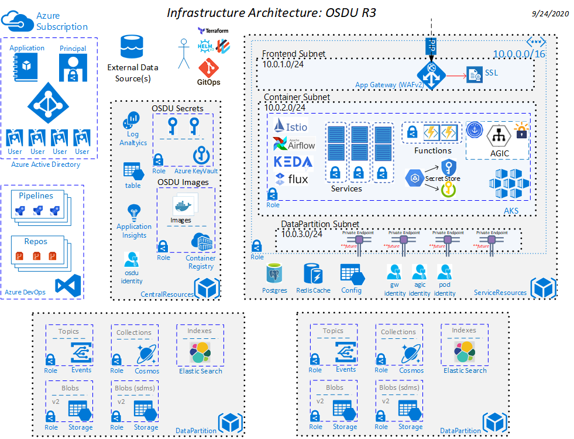

# Deploying OSDU services with Kubernetes + Elastic Cloud

v0.1 - 2/6/2020
v0.2 - 7/6/2020
v0.3 - 10/4/2020

## Introduction

Some of OSDU's enterprise customers have a small number of microservices they'd like to deploy and host on [AKS](https://docs.microsoft.com/en-us/azure/aks/). Geospatial documents are indexed in Elastic Search to accomodate bounding box and radius distance querying scenarios. This template provisions resources required to run OSDU Services in AKS and uses an instance of a fully managed PaaS Elasticsearch hosted in [EC](https://www.elastic.co/cloud/).

This document outlines how Cobalt has been extended to meet the use cases of these customers. The intended audience of this document is the development and product teams working on OSDU Infratructure on Azure and related projects.

## In Scope

- Diagram the architecture solution.
- Identify deployment topology needed
- Data Partition Integration
- Airflow Integration
- Bring your own Service Principal

## Out of scope

- Traffic Manager Integration
- APIM integration
- Elastic Search Service

## Key Terms
- **RG**: Abbreviation for “Resource Group”
- **Sub**: Abbreviation for “Subscription”
- **Persona**: An archetype of a Cobalt customer
- **Stage**: An application deployment stage (dev, qa, pre-prod, prod, etc...)
- **Region**: A location in which an application is deployed


## Customers
- **Admin**: This persona represents an administrator of Azure. This persona does not implement the line of business applications but will help other teams deliver them.
- **App Developer Team**: This persona is responsible for creating and maintaining the line of business applications

## Solution Architecture

This drawing shows the intended Azure Solution Architecture necessary.



## Deployment Topology

This graphic shows the targeted deployment topology needed by our enterprise customers. The deployment is deployed to a single tenant and subscription. The resources are partitioned to align with the different personas within the customer.


## Template Topology

The graphic below outlines the topology of the terraform templates that will deploy the topology called out above.


## Terraform Template Environment Dependencies

```
└── configurations
    ├── central_resources
    │   ├── main.tf
    │   └── terraform.tfvars
    ├── data_partition
    │   ├── main.tf
    │   ├── terraform.tfvars
    │   └── variables.tf
    ├── service_resources
    │   ├── agic.tf
    │   ├── aks.tf
    │   ├── backend.tf
    │   ├── commons.tf
    │   ├── keyvault.tf
    │   ├── networking.tf
    │   ├── outputs.tf
    │   ├── pod_identity.tf
    │   ├── security.tf
    │   ├── terraform.tfvars
    │   └── variables.tf
```

### central_resources

The [central_resources](../configurations/central_resources/main.tf) configuation is the resources that are central to an OSDU architecture. These resources need to exist first before any other configuration and can never be destroyed without impacting the entire data platform.

Items here incude things such as:
- Centralized Logging
- Key Vault
- User Assigned Identity


### service_resources

The [service_resources](../configurations/service_resources/main.tf) configuration relies on the resources from the [central_resources](../configurations/central_resources/main.tf) configuration and has the responsibility to store any sensitive information it creates to the central keyvault.  Additionally it is required to setup any maintain any roles it requires.

Items here include things such as:
- AKS Clusters
- Application Gateway
- Airflow Configuration Components


### data_partition

The [data_partition](../configurations/data_partition/main.tf) configuration relies on the resources from the [central_resources](../configuration/data_partition/main.tf) configuration and has the responsibility to store any sensitive information it creates to the central keyvault.  Additionally it is required to setup and maintain any roles it requires.

Items here include things such as:
- CosmosDB
- Storage Account
- Message Bus
- Event Grid


### Credential Management

The AKS cluster will be configured with a `SystemAssigned` identity to enable MSI integration with resources like Service Bus, ADLS Gen 2 and Keyvault. 

MSI is enabled through the [identity block](https://www.terraform.io/docs/providers/azurerm/r/kubernetes_cluster.html#type-2) of the `azurerm_kubernetes_cluster` Terraform provider.

You can reference the AKS MI [docs](https://docs.microsoft.com/en-us/azure/aks/use-managed-identity) for manual setup instructions.

## Security

Here is an overview of the security for the deployment strategy and templates discussed above:

The service principal running the deployment will have to be an owner in the target subscription.

This template will **not** create the OSDU environment service principal but one will have to be provided to the central resources configuration. This will eliminate the need to have an elevated service principal to deploy the solution. The service principalcreated will need to have Microsoft Graph Directory.Read.All access granted. 


## License
Copyright © Microsoft Corporation

Licensed under the Apache License, Version 2.0 (the "License");
you may not use this file except in compliance with the License.
You may obtain a copy of the License at 

[http://www.apache.org/licenses/LICENSE-2.0](http://www.apache.org/licenses/LICENSE-2.0)

Unless required by applicable law or agreed to in writing, software
distributed under the License is distributed on an "AS IS" BASIS,
WITHOUT WARRANTIES OR CONDITIONS OF ANY KIND, either express or implied.
See the License for the specific language governing permissions and
limitations under the License.