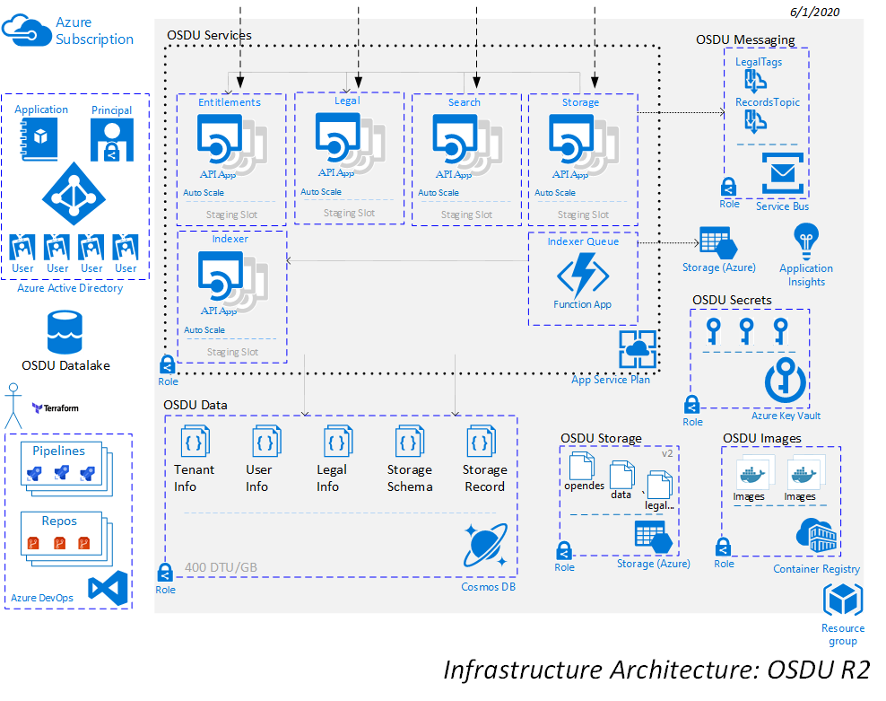
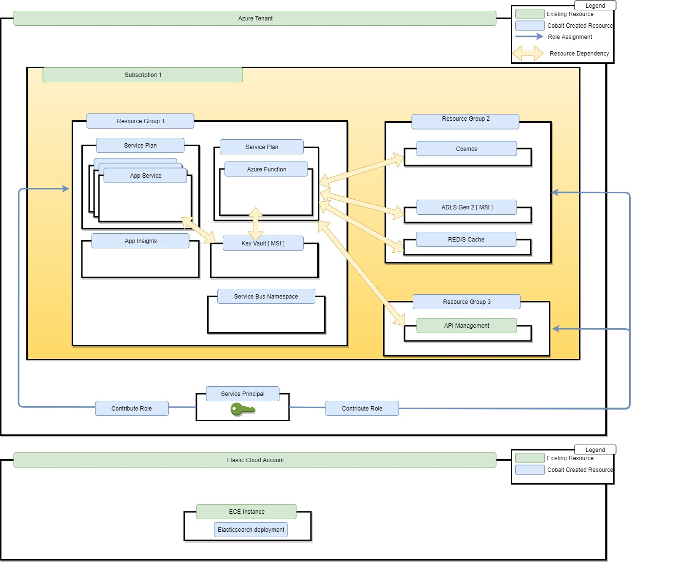
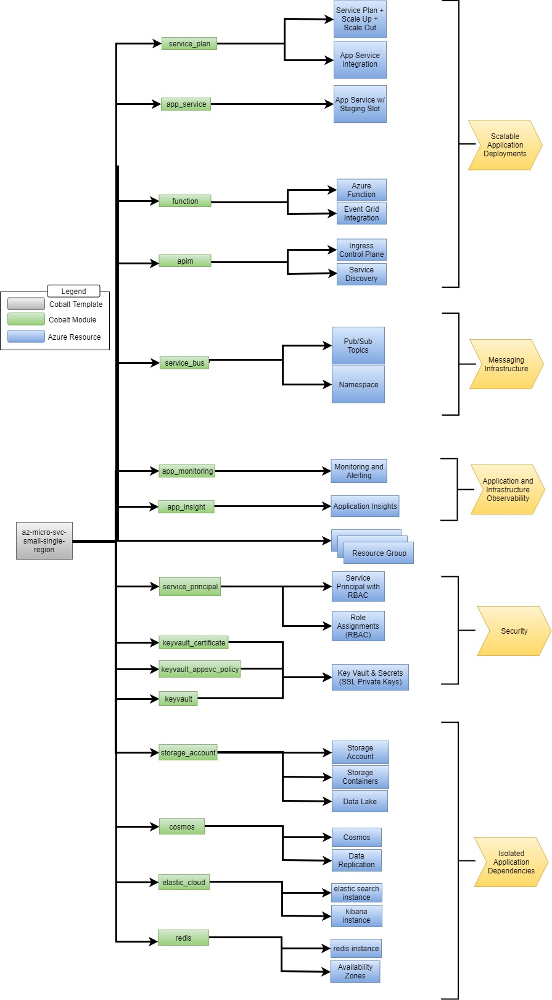
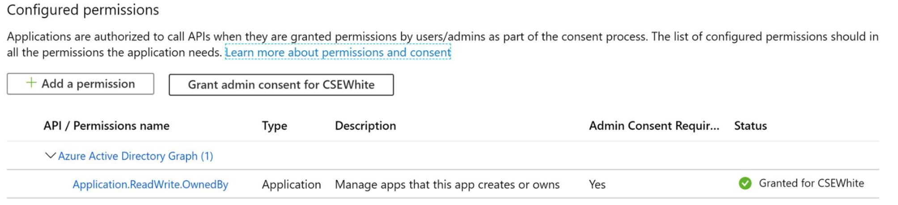

# Azure OSDU AppService Architecture Solution with Elastic Cloud SaaS

The `osdu-r2-resources` template is intended to deploy infrastructure necessary for the OSDU R2 Release using web apps for hosting the microservices and integrates with [Elastic Cloud](https://www.elastic.co/cloud/)


## Use-Case

This particular template creates an Azure environment with a small set of fully managed microservices backed by Azure Application Services. Our customer use-case had spatial data search requirements so Elasticsearch was an obvious choice. We had initially decided to use ECE with the intent to follow ElasticSearch cluster setup and security best practices, but moved later to ESS which is a hosted SaaS solution for Elastic Search.

Elastic Search Requirements require version 6.8.x and is currently tested against 6.8.3 with a valid SSL certificate on the endpoint.

A Servlerless Azure Function is used for our data processing layer with [Azure Service Bus](https://azure.microsoft.com/en-us/services/service-bus/) as our Pub/Sub Solution.  

## Scenarios this template should avoid

This template is an adequate solution where the service count is less than 10. For Azure customers interested with provisioning more than 10 services, we recommend using AKS and [Bedrock](https://github.com/microsoft/bedrock). Reason being that with Kubernetes you can maximize cluster node CPU cores which helps minimize cloud resourcing costs.  A future version anticipated with R3 will leverage AKS.


## Cloud Resource Architecture



## Technical Design
Template design [specifications](docs/README.md).
Elastic design [specification](docs/elastic.md).
Auth design [specification](docs/auth.md).

## Resource Topology



## Terraform Template Topology


## Intended audience

Cloud administrators that's versed with Cobalt templating.

## Prerequisites

1. Azure Subscription
2. An available Service Principal with API Permissions granted with Admin Consent within Azure app registration. The required Azure Active Directory Graph app role is `Application.ReadWrite.OwnedBy`

3. Terraform and Go are locally installed
4. Azure Storage Account is [setup](https://docs.microsoft.com/en-us/azure/terraform/terraform-backend) to store Terraform state
5. Local environment variables are [setup](https://github.com/Azure/osdu-infrastructure/blob/master/docs/osdu/INFRASTRUCTURE_DEPLOYMENTS.md)

## Cost

Azure environment cost ballpark [estimate](https://azure.com/e/09aab61ac8cd43b48c54c9d7290473cc). This is subject to change and is driven from the resource pricing tiers configured when the template is deployed. 

## Setup Instructions

_Eventually a bootstrap process will be handled by an [ado terraform provider](https://www.terraform.io/docs/providers/azuredevops/index.html) but for now this is a manual process._


## Automated Deployment Steps

### Create ADO and Import Projects for R2

> This typically takes about 10-15 minutes to complete.

- Create a new ADO Project in your organization called `osdu-r2`

- In the base project repo now import the base project
  - https://dev.azure.com/<your_organization>/osdu-r2/_git/osdu-r2

- Create Empty Repositories (No Readme)
  - osdu-infrastructure
  - entitlements-azure
  - legal
  - indexer-queue
  - storage
  - indexer
  - search
  - delivery

- Setup the Variable Group called 'Mirror Variables' necessary for the Pipeline

    | Variable | Value |
    |----------|-------|
    | ACCESS_TOKEN | <your_personal_access_token> |
    | INFRASTRUCTURE_REPO | https://dev.azure.com/<your_organization>/osdu-r2/_git/osdu-infrastructure |
    | ENTITLEMENTS_REPO | https://dev.azure.com/<your_organization>/osdu-r2/_git/entitlements-azure |
    | LEGAL_REPO | https://dev.azure.com/<your_organization>/osdu-r2/_git/legal |
    | INDEXER_QUEUE_REPO | https://dev.azure.com/<your_organization>/osdu-r2/_git/indexer-queue |
    | STORAGE_REPO | https://dev.azure.com/<your_organization>/osdu-r2/_git/storage |
    | INDEXER_REPO | https://dev.azure.com/<your_organization>/osdu-r2/_git/indexer |
    | SEARCH_REPO | https://dev.azure.com/<your_organization>/osdu-r2/_git/search |
    | DELIVERY_REPO | https://dev.azure.com/<your_organization>/osdu-r2/_git/delivery |

- Add a Pipeline __osdu-r2-repository-sync__ -->  `azure-pipelines.yml`

```yaml
#  Copyright © Microsoft Corporation
#
#  Licensed under the Apache License, Version 2.0 (the "License");
#  you may not use this file except in compliance with the License.
#  You may obtain a copy of the License at
#
#       http://www.apache.org/licenses/LICENSE-2.0
#
#  Unless required by applicable law or agreed to in writing, software
#  distributed under the License is distributed on an "AS IS" BASIS,
#  WITHOUT WARRANTIES OR CONDITIONS OF ANY KIND, either express or implied.
#  See the License for the specific language governing permissions and
#  limitations under the License.

# Note: Pipeline uses the Swellaby Mirror Git Repository extension
# Get it here: https://marketplace.visualstudio.com/items?itemName=swellaby.mirror-git-repository

# Required Group Variables - `Mirror Variables`
# ACCESS_TOKEN  (Personal Access Token)
# INFRASTRUCTURE_REPO
# ENTITLEMENTS_REPO
# LEGAL_REPO
# STORAGE_REPO
# INDEXER_QUEUE_REPO
# SEARCH_REPO

trigger:
  batch: true
  branches:
    include:
    - master
  paths:
    include:
    - /azure-pipeline.yml
    exclude:
    - /**/*.md

schedules:
  - cron: "*/10 * * * *"
    displayName: Hourly Pull Schedule
    branches:
      include:
      - master
    always: true

variables:
  - group: 'Mirror Variables'

jobs:
  - job: mirror_sync
    displayName: 'Pull Repositories'
    steps:

    - task: swellaby.mirror-git-repository.mirror-git-repository-vsts-task.mirror-git-repository-vsts-task@1
      displayName: 'entitlements-azure'
      inputs:
        sourceGitRepositoryUri: 'https://community.opengroup.org/osdu/platform/security-and-compliance/entitlements-azure.git'
        destinationGitRepositoryUri: '$(ENTITLEMENTS_REPO)'
        destinationGitRepositoryPersonalAccessToken: $(ACCESS_TOKEN)

    - task: swellaby.mirror-git-repository.mirror-git-repository-vsts-task.mirror-git-repository-vsts-task@1
      displayName: 'legal'
      inputs:
        sourceGitRepositoryUri: 'https://community.opengroup.org/osdu/platform/security-and-compliance/legal.git'
        destinationGitRepositoryUri: '$(LEGAL_REPO)'
        destinationGitRepositoryPersonalAccessToken: $(ACCESS_TOKEN)

    - task: swellaby.mirror-git-repository.mirror-git-repository-vsts-task.mirror-git-repository-vsts-task@1
      displayName: 'indexer-queue'
      inputs:
        sourceGitRepositoryUri: 'https://community.opengroup.org/osdu/platform/system/indexer-queue.git'
        destinationGitRepositoryUri: '$(INDEXER_QUEUE_REPO)'
        destinationGitRepositoryPersonalAccessToken: $(ACCESS_TOKEN)

    - task: swellaby.mirror-git-repository.mirror-git-repository-vsts-task.mirror-git-repository-vsts-task@1
      displayName: 'storage'
      inputs:
        sourceGitRepositoryUri: 'https://community.opengroup.org/osdu/platform/system/storage.git'
        destinationGitRepositoryUri: '$(STORAGE_REPO)'
        destinationGitRepositoryPersonalAccessToken: $(ACCESS_TOKEN)

    - task: swellaby.mirror-git-repository.mirror-git-repository-vsts-task.mirror-git-repository-vsts-task@1
      displayName: 'indexer'
      inputs:
        sourceGitRepositoryUri: 'https://community.opengroup.org/osdu/platform/system/indexer-service.git'
        destinationGitRepositoryUri: '$(INDEXER_REPO)'
        destinationGitRepositoryPersonalAccessToken: $(ACCESS_TOKEN)

    - task: swellaby.mirror-git-repository.mirror-git-repository-vsts-task.mirror-git-repository-vsts-task@1
      displayName: 'search'
      inputs:
        sourceGitRepositoryUri: 'https://community.opengroup.org/osdu/platform/system/search-service.git'
        destinationGitRepositoryUri: '$(SEARCH_REPO)'
        destinationGitRepositoryPersonalAccessToken: $(ACCESS_TOKEN)

    - task: swellaby.mirror-git-repository.mirror-git-repository-vsts-task.mirror-git-repository-vsts-task@1
      displayName: 'delivery'
      inputs:
        sourceGitRepositoryUri: 'https://community.opengroup.org/osdu/platform/system/delivery.git'
        destinationGitRepositoryUri: '$(DELIVERY_REPO)'
        destinationGitRepositoryPersonalAccessToken: $(ACCESS_TOKEN)

```

- Execute the Pipeline which will then pull the required code into the ADO project repos.


### Build osdu-infrastructure for R2

> This typically takes about 2 hours to complete.

__Prerequisites__

Here is an Azure Virtual [Developer Machine](https://github.com/danielscholl/hol-win10) that can be used if necessary.

>Procedures are tested using Ubuntu within WSL for Windows 10.  _(Typically MacOS works well)_

__Clone Infrastructure__

Clone the osdu-infrastructure repository to a local machine.

__Execute Install Script__

The script ./scripts/install.sh will conveniently setup the common things that are necessary to execute a pipeline.

- Login to the azure cli and set the default account to the desired subscription.

- Follow the instructions for bootstraping the osdu-infrastructure pipeline located in the README.md of that project space.

### Installed Common Resources

1. Resource Group
2. Storage Account
3. Key Vault
4. Applications for Integration Testing (2)

__Elastic Search Setup__

Infrastructure assumes bring your own Elastic Search Instance at a version of `6.8.3` and access information must be stored in the Common KeyVault.

```bash
AZURE_VAULT="<your_keyvault>"
az keyvault secret set --vault-name $AZURE_VAULT --name "elastic-endpoint-ado-demo" --value <your_es_endpoint>
az keyvault secret set --vault-name $AZURE_VAULT --name "elastic-username-ado-demo" --value <your_es_username>
az keyvault secret set --vault-name $AZURE_VAULT --name "elastic-password-ado-demo" --value <your_es_password>

# This command will extract all Key Vault Secrets
for i in `az keyvault secret list --vault-name $AZURE_VAULT --query [].id -otsv`
do
   echo "export ${i##*/}=\"$(az keyvault secret show --vault-name $AZURE_VAULT --id $i --query value -otsv)\""
done

```

### Configure Azure DevOps Service Connection

- Configure an [ARM Resources Service Connection](https://docs.microsoft.com/en-us/azure/devops/pipelines/library/connect-to-azure?view=azure-devops) for the desired subscription.
  - Scope should be to the desired Subscription but do not apply scope to a Resource Group

- Locate the Service Principal created (<organization-project-subscription>) in Azure Active Directory and elevate the principal capability by adding in 2 API Permissions
  - Azure Active Directory Graph - Application.ReadWrite.OwnedBy
  - Microsoft Graph - Application.ReadWrite.OwnedBy

> These 2 API's require `Grant Admin Consent`

- In Azure Portal locate the subscription and under Access control (IAM) add an Owner Role Assignment to the principal then remove the default created Contributor role.


### Setup ADO required Libraries

- Setup and Configure the ADO Library `Infrastructure Pipeline Variables`

  | Variable | Value |
  |----------|-------|
  | AGENT_POOL | Hosted Ubuntu 1604 |
  | BUILD_ARTIFACT_NAME | infra-templates` |
  | SERVICE_CONNECTION_NAME | <your_service_connection_name> |
  | TF_VAR_elasticsearch_secrets_keyvault_name | osducommon<your_unique>-kv |
  | TF_VAR_elasticsearch_secrets_keyvault_resource_group | osdu-common-<your_unique> |
  | TF_VAR_remote_state_account | osducommon<your_unique> |
  | TF_VAR_remote_state_container | remote-state-container |

- Setup and Configure the ADO Library `Infrastructure Pipeline Variables - demo`

  | Variable | Value |
  |----------|-------|
  | ARM_SUBSCRIPTION_ID | <your_subscription_id> |
  | TF_VAR_resource_group_location | centralus |
  | TF_VAR_cosmosdb_replica_location | eastus2 |
  | TF_VAR_elasticsearch_version | 6.8.3 |

> You can specify the desired region locations you wish.

- Setup and Configure the ADO Library `Infrastructure Pipeline Secrets - demo`

  | Variable | Value |
  |----------|-------|
  | elastic-endpoint-ado-demo | `*********` |
  | elastic-username-ado-demo | `*********` |
  | elastic-password-ado-demo | `*********` |

> This should be linked Secrets from Azure Key Vault `osducommon<your_unique>-kv`

- Setup 2 Secure Files
  - azure-aks-gitops-ssh-key
  - azure-aks-node-ssh-key.pub

** This is future AKS work but required. Ensure the names of files uploaded have the exact names listed which will require renaming the .ssh key information created by the script.

- Add a Pipeline __osdu-infrastructure__ -->  `azure-pipelines.yml` and execute it.

- Once Infrastructure is deployed grant admin_consent to the Service Principal

> Review the Readme for the [template](https://github.com/Azure/osdu-infrastructure/blob/master/infra/templates/osdu-r2-resources/README.md) as necessary.


## Deploy OSDU Services

> This typically takes about 3-4 hours to complete.

### Setup Common ADO Libraries

- Setup and Configure the ADO Library `Azure Common`

| Variable | Value |
|----------|-------|
| AGENT_POOL | `Hosted Ubuntu 1604` |
| AZURE_AD_APP_RESOURCE_ID | `$(aad-client-id)` |
| AZURE_AD_OTHER_APP_RESOURCE_ID | `$(osdu-infra-<your_unique>-test-app-id)` |
| AZURE_AD_OTHER_APP_RESOURCE_OID | `$(osdu-infra-<your_unique>-test-app-oid)` |
| AZURE_DEPLOY_APPSERVICE_PLAN | `$(ENVIRONMENT_RG_PREFIX)-$(PREFIX_BASE)-sp` |
| AZURE_DEPLOY_CLIENT_ID| `$(app-dev-sp-username)` |
| AZURE_DEPLOY_CLIENT_SECRET| `$(app-dev-sp-password)` |
| AZURE_DEPLOY_RESOURCE_GROUP| `$(ENVIRONMENT_RG_PREFIX)-$(PREFIX_BASE)-app-rg` |
| AZURE_DEPLOY_TENANT | `$(app-dev-sp-tenant-id)` |
| AZURE_ENTITLEMENTS_SERVICE_NAME | `$(ENVIRONMENT_SERVICE_PREFIX)-entitlements` |
| AZURE_INDEXER_SERVICE_NAME | `$(ENVIRONMENT_SERVICE_PREFIX)-indexer` |
| AZURE_LEGAL_SERVICE_NAME | `$(ENVIRONMENT_SERVICE_PREFIX)-legal` |
| AZURE_LEGAL_SERVICEBUS | `$(sb-connection)` |
| AZURE_LEGAL_TOPICNAME | `legaltags` |
| AZURE_SEARCH_SERVICE_NAME | `$(ENVIRONMENT_SERVICE_PREFIX)-search` |
| AZURE_STORAGE_ACCOUNT | `$(ENVIRONMENT_STORAGE_PREFIX)sa` |
| AZURE_STORAGE_SERVICE_NAME | `$(ENVIRONMENT_SERVICE_PREFIX)-storage` |
| AZURE_TESTER_SERVICEPRINCIPAL_SECRET | `$(app-dev-sp-password)` |
| CONTAINER_REGISTRY_NAME | `$(ENVIRONMENT_STORAGE_PREFIX)cr` |
| DEPLOY_ENV | `empty` |
| DOMAIN | `contoso.com` |
| ENTITLEMENT_URL | `https://$(AZURE_ENTITLEMENTS_SERVICE_NAME).azurewebsites.net/` |
| EXPIRED_TOKEN |  |
| FUNCTION_APP_NAME | `$(ENVIRONMENT_BASE_NAME_21)-enque` |
| LEGAL_URL | `https://$(AZURE_LEGAL_SERVICE_NAME).azurewebsites.net/` |
| INTEGRATION_TESTER | `$(app-dev-sp-username)` |
| MY_TENANT | `opendes` |
| NO_DATA_ACCESS_TESTER | `$(osdu-infra-azg-test-app-noaccess-id)` |
| NO_DATA_ACCESS_TESTER_SERVICEPRINCIPAL_SECRET | `$(osdu-infra-azg-test-app-noaccess-key)` |
| PREFIX_BASE | `osdu-r2` |
| PUBSUB_TOKEN | `az` |
| RESOURCE_GROUP_NAME | `$(ENVIRONMENT_RG_PREFIX)-$(PREFIX_BASE)-app-rg` |
| SEARCH_URL | `https://$(AZURE_SEARCH_SERVICE_NAME).azurewebsites.net/` |
| SERVICE_CONNECTION_NAME| `osdu-infrastructure` |
| STORAGE_URL | `https://$(AZURE_STORAGE_SERVICE_NAME).azurewebsites.net/` |
| _GOOGLE_CLOUD_PROJECT_ | _`opendes`_ |


> There is a current bug in legal that is pending being fixed the requires the `GOOGLE_CLOUD_PROJECT` variable to be set to build legal-core and pass the unit tests.

- Setup and Configure the ADO Library `Azure Common Secrets`
> This Library is linked to the Common Key Vault

- osdu-infra-{unique}-test-app-id
- osdu-infra-{unique}-test-app-key
- osdu-infra-{unique}-test-app-oid
- osdu-infra-{unique}-test-app-noaccess-id
- osdu-infra-{unique}-test-app-noaccess-key
- ad-user-email
- ad-user-oid
- ad-guest-email
- ad-guest-oid

### Setup Environment ADO Libraries

- Setup and Configure the ADO Library `Azure Target Env - demo`

| Variable | Value |
|----------|-------|
| ENVIRONMENT_BASE_NAME_21 |  _(ie: ado-demo-5xn-5xny9wvc)_ |
| ENVIRONMENT_RG_PREFIX    |   _(ie:  ado-demo-5xny9wvc)_   |
| ENVIRONMENT_SERVICE_PREFIX  | $(ENVIRONMENT_BASE_NAME_21)-au |
| ENVIRONMENT_STORAGE_PREFIX  | _(ie:  adodemo5xn5xny9wvc)_ |
| AZURE_DEPLOY_SUBSCRIPTION   | <your_subscription_id> |

- Setup and Configure the ADO Library `Azure Target Env Secrets - demo`
> This Library is linked to the Enviroment Key Vault

- aad-client-id
- app-dev-sp-password
- app-dev-sp-username
- appinsights-key
- cosmos-connection
- cosmos-endpoint
- cosmos-primary-key
- elastic-endpoint
- elastic-password
- elastic-username
- entitlement-key
- sb-connection
- storage-account-key


### Setup Service ADO Libraries

- __Setup and Configure the ADO Library__ `Azure Service Release - entitlements`

| Variable | Value |
|----------|-------|
| MAVEN_DEPLOY_GOALS | `azure-webapp:deploy` |
| MAVEN_DEPLOY_OPTIONS | `--settings $(System.DefaultWorkingDirectory)/drop/maven/settings.xml -DAZURE_DEPLOY_TENANT=$(AZURE_DEPLOY_TENANT) -DAZURE_DEPLOY_CLIENT_ID=$(AZURE_DEPLOY_CLIENT_ID) -DAZURE_DEPLOY_CLIENT_SECRET=$(AZURE_DEPLOY_CLIENT_SECRET) -Dazure.appservice.resourcegroup=$(AZURE_DEPLOY_RESOURCE_GROUP) -Dazure.appservice.plan=$(AZURE_DEPLOY_APPSERVICE_PLAN) -Dazure.appservice.appname=$(AZURE_ENTITLEMENTS_SERVICE_NAME) -Dazure.appservice.subscription=$(AZURE_DEPLOY_SUBSCRIPTION)` |
| MAVEN_DEPLOY_POM_FILE_PATH | `drop` |
| MAVEN_INTEGRATION_TEST_OPTIONS | `-DDOMAIN=$(DOMAIN) -DENTITLEMENT_URL=$(ENTITLEMENT_URL) -DENTITLEMENT_APP_KEY=$(entitlement-key) -DMY_TENANT=$(MY_TENANT) -DINTEGRATION_TESTER=$(INTEGRATION_TESTER) -DAZURE_TESTER_SERVICEPRINCIPAL_SECRET=$(AZURE_TESTER_SERVICEPRINCIPAL_SECRET) -DAZURE_AD_TENANT_ID=$(AZURE_DEPLOY_TENANT) -DAZURE_AD_APP_RESOURCE_ID=$(AZURE_AD_APP_RESOURCE_ID) -DAZURE_AD_OTHER_APP_RESOURCE_ID=$(AZURE_AD_OTHER_APP_RESOURCE_ID) -DAZURE_AD_OTHER_APP_RESOURCE_OID=$(AZURE_AD_OTHER_APP_RESOURCE_OID) -DEXPIRED_TOKEN=$(EXPIRED_TOKEN) -DENTITLEMENT_MEMBER_NAME_VALID=$(INTEGRATION_TESTER) -DENTITLEMENT_MEMBER_NAME_INVALID=InvalidTestAdmin -DENTITLEMENT_GROUP_NAME_VALID=integ.test.data.creator -DAZURE_AD_USER_EMAIL=$(ad-user-email) -DAZURE_AD_USER_OID=$(ad-user-oid) -DAZURE_AD_GUEST_EMAIL=$(ad-guest-email) -DAZURE_AD_GUEST_OID=$(ad-guest-oid)` |
| MAVEN_INTEGRATION_TEST_POM_FILE_PATH | `drop/deploy/integration-tests` |
| SERVICE_RESOURCE_NAME | `$(AZURE_ENTITLEMENTS_SERVICE_NAME)` |


- __Setup and Configure the ADO Library__ `Azure Service Release - legal`

| Variable | Value |
|----------|-------|
| MAVEN_DEPLOY_GOALS | `azure-webapp:deploy` |
| MAVEN_DEPLOY_OPTIONS | `--settings $(System.DefaultWorkingDirectory)/drop/provider/legal-azure/maven/settings.xml -DAZURE_DEPLOY_TENANT=$(AZURE_DEPLOY_TENANT) -DAZURE_DEPLOY_CLIENT_ID=$(AZURE_DEPLOY_CLIENT_ID) -DAZURE_DEPLOY_CLIENT_SECRET=$(AZURE_DEPLOY_CLIENT_SECRET) -Dazure.appservice.resourcegroup=$(AZURE_DEPLOY_RESOURCE_GROUP) -Dazure.appservice.plan=$(AZURE_DEPLOY_APPSERVICE_PLAN) -Dazure.appservice.appname=$(AZURE_LEGAL_SERVICE_NAME) -Dazure.appservice.subscription=$(AZURE_DEPLOY_SUBSCRIPTION)` |
| MAVEN_DEPLOY_POM_FILE_PATH | `drop/provider/legal-azure` |
| MAVEN_INTEGRATION_TEST_OPTIONS | `-DINTEGRATION_TESTER=$(INTEGRATION_TESTER) -DHOST_URL=$(LEGAL_URL) -DENTITLEMENT_URL=$(ENTITLEMENT_URL) -DMY_TENANT=$(MY_TENANT) -DAZURE_TESTER_SERVICEPRINCIPAL_SECRET=$(AZURE_TESTER_SERVICEPRINCIPAL_SECRET) -DAZURE_AD_TENANT_ID=$(AZURE_DEPLOY_TENANT) -DAZURE_AD_APP_RESOURCE_ID=$(AZURE_AD_APP_RESOURCE_ID) -DAZURE_LEGAL_STORAGE_ACCOUNT=$(AZURE_STORAGE_ACCOUNT) -DAZURE_LEGAL_STORAGE_KEY=$(storage-account-key) -DAZURE_LEGAL_SERVICEBUS=$(AZURE_LEGAL_SERVICEBUS) -DAZURE_LEGAL_TOPICNAME=$(AZURE_LEGAL_TOPICNAME)` |
| MAVEN_INTEGRATION_TEST_POM_FILE_PATH | `drop/deploy/testing/legal-test-azure/pom.xml` |
| SERVICE_RESOURCE_NAME | `$(AZURE_LEGAL_SERVICE_NAME)` |


__- Setup and Configure the ADO Library__ `Azure Service Release - storage`

| Variable | Value |
|----------|-------|
| MAVEN_DEPLOY_GOALS | `azure-webapp:deploy` |
| MAVEN_DEPLOY_OPTIONS | `--settings $(System.DefaultWorkingDirectory)/drop/provider/storage-azure/maven/settings.xml -DAZURE_DEPLOY_TENANT=$(AZURE_DEPLOY_TENANT) -DAZURE_DEPLOY_CLIENT_ID=$(AZURE_DEPLOY_CLIENT_ID) -DAZURE_DEPLOY_CLIENT_SECRET=$(AZURE_DEPLOY_CLIENT_SECRET) -Dazure.appservice.resourcegroup=$(AZURE_DEPLOY_RESOURCE_GROUP) -Dazure.appservice.plan=$(AZURE_DEPLOY_APPSERVICE_PLAN) -Dazure.appservice.appname=$(AZURE_STORAGE_SERVICE_NAME) -Dazure.appservice.subscription=$(AZURE_DEPLOY_SUBSCRIPTION)` |
| MAVEN_DEPLOY_POM_FILE_PATH | `drop/provider/storage-azure` |
| MAVEN_INTEGRATION_TEST_OPTIONS | `-DDOMAIN=$(DOMAIN) -DSTORAGE_URL=$(STORAGE_URL) -DLEGAL_URL=$(LEGAL_URL) -DINTEGRATION_TESTER=$(INTEGRATION_TESTER) -DNO_DATA_ACCESS_TESTER=$(NO_DATA_ACCESS_TESTER) -DTESTER_SERVICEPRINCIPAL_SECRET=$(AZURE_TESTER_SERVICEPRINCIPAL_SECRET) -DNO_DATA_ACCESS_TESTER_SERVICEPRINCIPAL_SECRET=$(NO_DATA_ACCESS_TESTER_SERVICEPRINCIPAL_SECRET) -DAZURE_AD_TENANT_ID=$(AZURE_DEPLOY_TENANT) -DAZURE_AD_APP_RESOURCE_ID=$(AZURE_AD_APP_RESOURCE_ID) -DDEPLOY_ENV=$(DEPLOY_ENV) -DPUBSUB_TOKEN=$(PUBSUB_TOKEN) -DTENANT_NAME=$(MY_TENANT) -DAZURE_STORAGE_ACCOUNT=$(AZURE_STORAGE_ACCOUNT)` |
| MAVEN_INTEGRATION_TEST_POM_FILE_PATH | `drop/deploy/testing/storage-test-azure` |
| SERVICE_RESOURCE_NAME | `$(AZURE_STORAGE_SERVICE_NAME)` |
`


__- Setup and Configure the ADO Library__ `Azure Service Release - indexer`

| Variable | Value |
|----------|-------|
| MAVEN_DEPLOY_GOALS | `azure-webapp:deploy` |
| MAVEN_DEPLOY_OPTIONS | `--settings $(System.DefaultWorkingDirectory)/drop/provider/indexer-azure/maven/settings.xml -DAZURE_DEPLOY_TENANT=$(AZURE_DEPLOY_TENANT) -DAZURE_DEPLOY_CLIENT_ID=$(AZURE_DEPLOY_CLIENT_ID) -DAZURE_DEPLOY_CLIENT_SECRET=$(AZURE_DEPLOY_CLIENT_SECRET) -Dazure.appservice.resourcegroup=$(AZURE_DEPLOY_RESOURCE_GROUP) -Dazure.appservice.plan=$(AZURE_DEPLOY_APPSERVICE_PLAN) -Dazure.appservice.appname=$(AZURE_INDEXER_SERVICE_NAME) -Dazure.appservice.subscription=$(AZURE_DEPLOY_SUBSCRIPTION) -DELASTIC_USER_NAME=$(elastic-username) -DELASTIC_PASSWORD=$(elastic-password) -DELASTIC_HOST=$(elastic-host) -DELASTIC_PORT=$(elastic-port)` |
| MAVEN_DEPLOY_POM_FILE_PATH | `drop/provider/indexer-azure` |
| MAVEN_INTEGRATION_TEST_OPTIONS | `-DAZURE_AD_TENANT_ID=$(AZURE_DEPLOY_TENANT) -DAZURE_TESTER_SERVICEPRINCIPAL_SECRET=$(AZURE_TESTER_SERVICEPRINCIPAL_SECRET) -DINTEGRATION_TESTER=$(INTEGRATION_TESTER) -DAZURE_AD_APP_RESOURCE_ID=$(AZURE_AD_APP_RESOURCE_ID) -DELASTIC_USER_NAME=$(elastic-username) -DELASTIC_PASSWORD=$(elastic-password) -DELASTIC_HOST=$(elastic-host) -DELASTIC_PORT=$(elastic-port)  -DDEFAULT_DATA_PARTITION_ID_TENANT1=$(MY_TENANT) -DDEFAULT_DATA_PARTITION_ID_TENANT2=othertenant2 -DLEGAL_TAG=opendes-public-usa-dataset-7643990 -DOTHER_RELEVANT_DATA_COUNTRIES=US -DENTITLEMENTS_DOMAIN=contoso.com -DENVIRONMENT=CLOUD -DSTORAGE_HOST=$(STORAGE_URL)` |
| MAVEN_INTEGRATION_TEST_POM_FILE_PATH | `drop/deploy/testing/indexer-test-azure` |
| SERVICE_RESOURCE_NAME | `$(AZURE_INDEXER_SERVICE_NAME)` |


__- Setup and Configure the ADO Library__ `Azure Service Release - search`

| Variable | Value |
|----------|-------|
| MAVEN_DEPLOY_GOALS | `azure-webapp:deploy` |
| MAVEN_DEPLOY_OPTIONS | `--settings $(System.DefaultWorkingDirectory)/drop/provider/search-azure/maven/settings.xml -DAZURE_DEPLOY_TENANT=$(AZURE_DEPLOY_TENANT) -DAZURE_DEPLOY_CLIENT_ID=$(AZURE_DEPLOY_CLIENT_ID) -DAZURE_DEPLOY_CLIENT_SECRET=$(AZURE_DEPLOY_CLIENT_SECRET) -Dazure.appservice.resourcegroup=$(AZURE_DEPLOY_RESOURCE_GROUP) -Dazure.appservice.plan=$(AZURE_DEPLOY_APPSERVICE_PLAN) -Dazure.appservice.appname=$(AZURE_SEARCH_SERVICE_NAME) -Dazure.appservice.subscription=$(AZURE_DEPLOY_SUBSCRIPTION)` |
| MAVEN_DEPLOY_POM_FILE_PATH | `drop/provider/search-azure` |
| MAVEN_INTEGRATION_TEST_OPTIONS | `-DOTHER_RELEVANT_DATA_COUNTRIES= -DINTEGRATION_TEST_AUDIENCE= -DDEFAULT_DATA_PARTITION_ID_TENANT1=$(MY_TENANT) -DDEFAULT_DATA_PARTITION_ID_TENANT2=othertenant2 -DELASTIC_USER_NAME=$(elastic-username) -DELASTIC_PASSWORD=$(elastic-password) -DELASTIC_HOST=$(elastic-host) -DELASTIC_PORT=$(elastic-port) -DINDEXER_HOST=$() -DENTITLEMENTS_DOMAIN=$(DOMAIN) -DSEARCH_HOST=$(SEARCH_URL)api/search/v2/ -DSTORAGE_HOST=$() -DINTEGRATION_TESTER=$(INTEGRATION_TESTER) -DAZURE_TESTER_SERVICEPRINCIPAL_SECRET=$(AZURE_TESTER_SERVICEPRINCIPAL_SECRET) -DAZURE_AD_TENANT_ID=$(AZURE_DEPLOY_TENANT) -DAZURE_AD_APP_RESOURCE_ID=$(AZURE_AD_APP_RESOURCE_ID)` |
| MAVEN_INTEGRATION_TEST_POM_FILE_PATH | `drop/deploy/testing/integration-tests/search-test-azure` |
| SERVICE_RESOURCE_NAME | `$(AZURE_SEARCH_SERVICE_NAME)` |


### Load Cosmos DB Integration Test Data

The data to be loaded before services are deployed and can be found in the osdu-infrastructure repository `osdu-infrastructure/docs/osdu/integration-test-data/` and has to be modified with environment specific information as necessary.

- tenant_info_1.json
- tenant_info_2.json
- user_info_1.json
- user_info_2.json
- legal_tag_1.json
- legal_tag_2.json
- legal_tag_3.json
- storage_schema_1.json
- storage_schema_2.json
- storage_schema_3.json
- storage_schema_4.json
- storage_schema_5.json
- storage_schema_6.json
- storage_schema_7.json
- storage_schema_8.json
- storage_schema_9.json
- storage_schema_10.json
- storage_schema_11.json


### Configure the ADO Service Pipelines

Create the pipelines and run things in this exact order.

- Add a Pipeline __entitlements-azure__ -->  Repo: entitlements-azure Path:`/devops/azure-pipelines.yml` and execute it.
  - This pipeline will have to be run twice for integration tests to pass due to a preload data issue.

- Add a Pipeline __legal__ -->  Repo: legal Path:`/devops/azure-pipelines.yml` and execute it.

- Add a Pipeline __indexer-queue__ -->  Repo: indexer-queue Path:`/devops/azure-pipelines.yml` and execute it.
  > Note: This is a manual deploy at the moment.

- Add a Pipeline __storage__ -->  Repo: storage Path:`/devops/azure-pipelines.yml` and execute it.
  > Note: The integration tests will fail due to delivery being part of storage which requires indexer and search. Ignore the error and proceed.

- Add a Pipeline __indexer__ -->  Repo: indexer Path:`/devops/azure-pipelines.yml` and execute it.

- Add a Pipeline __search__ -->  Repo: search Path:`/devops/azure-pipelines.yml` and execute it.

- Rerun the Pipeline for __storage__ so that tests now pass.


## Data Loading

The environment should now be ready for loading data please refer to the OSDU Data Loading Process for instructions on how to load data into an environment.

> This typically takes about 15-20 hours to complete.


## Manual Deployment Steps

1. Execute the following commands to set up your local environment variables:

We recommend running [direnv](https://direnv.net/) for sourcing your environment variables.

*Note for Windows Users using WSL*: We recommend running dos2unix utility on the environment file via `dos2unix .env` prior to sourcing your environment variables to chop trailing newline and carriage return characters.

```bash
# these commands setup all the environment variables needed to run this template
DOT_ENV=<path to your .env file>
export $(cat $DOT_ENV | xargs)
```

2. Execute the following command to configure your local Azure CLI.

```bash
# This logs your local Azure CLI in using the configured service principal.
az login --service-principal -u $ARM_CLIENT_ID -p $ARM_CLIENT_SECRET --tenant $ARM_TENANT_ID
```

3. Execute the following commands to set up your terraform workspace.

```bash
# This configures terraform to leverage a remote backend that will help you and your
# team keep consistent state
terraform init -backend-config "storage_account_name=${TF_VAR_remote_state_account}" -backend-config "container_name=${TF_VAR_remote_state_container}"

# This command configures terraform to use a workspace unique to you. This allows you to work
# without stepping over your teammate's deployments
TF_WORKSPACE="$USER"
terraform workspace new $TF_WORKSPACE || terraform workspace select $TF_WORKSPACE
```

4. Execute the following commands to orchestrate a deployment.

```bash
# See what terraform will try to deploy without actually deploying
terraform plan

# Execute a deployment
terraform apply
```


### Azure AD Application Admin Consent
>NOTE: This is a required Manual Step.

The deployment by default creates a Service Prinicpal with the naming convention <env_unique>.osdu-r2-ad-app-management.  This service principal requires the ability to access the Microsoft Graph API and a final manual step is required for an admin to grant-consent as described in the [Azure AD Application Management Documentation](https://docs.microsoft.com/en-us/azure/active-directory/manage-apps/grant-admin-consent#grant-admin-consent-in-app-registrations).


#### Unit Testing 

Navigate to the template folder `infra/templates/az-micro-svc-small-elastic-cloud`. Unit tests can be run using the following command:

```
go test -v $(go list ./... | grep "unit")
```

#### Integration Testing

Please confirm that you've completed the `terraform apply` step before running the integration tests as we're validating the active terraform workspace.

Integration tests can be run using the following command:

```
go test -v $(go list ./... | grep "integration")
```


## License
Copyright © Microsoft Corporation

Licensed under the Apache License, Version 2.0 (the "License");
you may not use this file except in compliance with the License.
You may obtain a copy of the License at 

[http://www.apache.org/licenses/LICENSE-2.0](http://www.apache.org/licenses/LICENSE-2.0)

Unless required by applicable law or agreed to in writing, software
distributed under the License is distributed on an "AS IS" BASIS,
WITHOUT WARRANTIES OR CONDITIONS OF ANY KIND, either express or implied.
See the License for the specific language governing permissions and
limitations under the License.