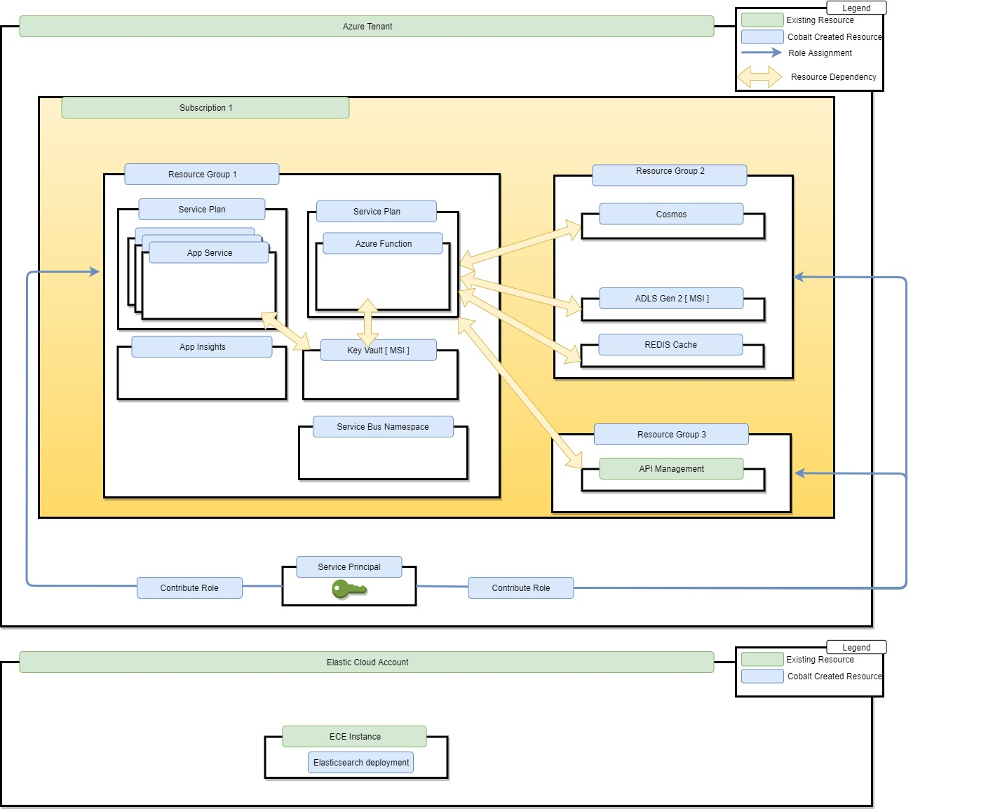
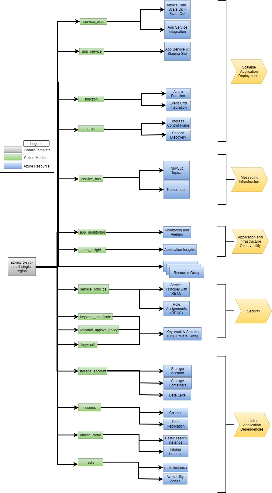

# Deploying App Service Collection with Elastic Cloud Full Text PaaS Search Solution

v0.1 - 12/4/2019

## Introduction

Some of Cobalt’s enterprise customers have a small number of microservices they'd like to deploy and host with Azure managed PaaS app services. Geospatial documents are indexed in Elastic Search to accomodate bounding box and radius distance querying scenarios. This template provisions an instance of an fully managed PaaS Elasticsearch hosted in [EC](https://www.elastic.co/cloud/).

This document outlines how Cobalt can be extended to meet the use cases of these customers. The intended audience of this document is the development and product teams working on Cobalt and related projects.

## In Scope

- Identify deployment topology needed by the customer
- Identify key Terraform templates needed for deployment
- Identify key Terraform modules needed for deployment
- Identify gaps in Terraform provider templates

## Out of scope

- External customer sign-off
- Template (Terraform, ARM) implementation
- VNET Integration
- Service Containerization
- How existing storage services like Elastic Cloud and Cosmos can be imported to reduce azure subscription incurred costs

## Key Terms
- **RG**: Abbreviation for “Resource Group”
- **Sub**: Abbreviation for “Subscription”
- **Persona**: An archetype of a Cobalt customer
- **Stage**: An application deployment stage (dev, qa, pre-prod, prod, etc...)
- **Region**: A location in which an application is deployed


## Customers
- **Admin**: This persona represents an administrator of Azure. This persona does not implement the line of business applications but will help other teams deliver them.
- **App Developer Team**: This persona is responsible for creating and maintaining the line of business applications

## Open Questions

These open questions may impact the implementation plan and overall scope of the deployment described below

- What are the azure monitoring rules for this template?
- How can we shard a single instance of APIM so that it can be shared by many azure environments?
- How can we shard a single instance of Elastic Seach so that it can be shared by many azure environments?

## Deployment Topology

This graphic shows the targeted deployment topology needed by our enterprise customers. The deployment is deployed to a single tenant and subscription. The resources are partitioned to align with the different personas within the customer.



## Template Topology

The graphic below outlines the topology of the terraform templates that will deploy the topology called out above.



## Module and Template Deep Dive

### Template Inputs
General Configuration
| name | type | default | description |
|---|---|---|---|
| `resource_group_location` | string |  | The Azure region where all resources in this template should be created |
| `prefix` | string |  | It serves as an identifier used to construct the names of all resources in this template
| `randomization_level` | number |  | Number of additional random characters to include in resource names to insulate against unexpected resource name collisions |

Service Plan Configuration
| name | type | default | description |
|---|---|---|---|
| `monitoring_dimension_values` | `["*"]` |  | Dimensions used to determine service plan scaling |
| `service_plan_size` | string | S1 | The size of the service plan instance. Valid values are I1, I2, I3 |
| `service_plan_tier` | string | Standard | The size of the service plan instance. Valid values are I1, I2, I3 |
| `scaling_rules` | list(obj) |  | The scaling rules for the app service plan. |

App Service Configuration
| name | type | default | description |
|---|---|---|---|
| `app_services` | list(obj) |  | Metadata about apps to deploy that also require authentication |
| `vnet_subnet_id` | string |  | The vnet integration subnet gateway identifier

Azure Function Configuration
| name | type | default | description |
|---|---|---|---|
| `function_apps` | list(obj) |  | Metadata about functions to deploy, such as repository location, docker file metadata and image names |

Azure Container Registry Configuration
| name | type | default | description |
|---|---|---|---|
| `container_registry_sku` | list(obj) | Standard | The container registry SKU. ie. 'Standard' 'Premium'. |

App Service Authentication Configuration
| name | type | default | description |
|---|---|---|---|
| `auth_suffix` | string | easy-auth | A name to be appended to all azure ad applications |

Cosmos Configuration
| name | type | default | description |
|---|---|---|---|
| `primary_replica_location` | string |  | The name of the Azure region to host replicated data |
| `cosmosdb_automatic_failover` | boolean | false | Determines if automatic failover is enabled for the created CosmosDB |
| `consistency_level` | string | Session | The Consistency Level to use for this CosmosDB Account. Can be either 'BoundedStaleness', 'Eventual', 'Session', 'Strong' or 'ConsistentPrefix' |

ServiceBus Configuration
| name | type | default | description |
|---|---|---|---|
| `service_bus_namespace_name` | string |  | The name of service bus namespace |
| `service_bus_topics` | list(object({topic_name=string subscriptions=list(string)})) | 0 | The configuration of service bus topic and subscriptions mapping |

Elastic Configuration
| name | type | default | description |
|---|---|---|---|
| `high_availability_environment_count` | number | 0 | The number of high availability clusters that should be created |
| `data_node_size_gb` | number | 4 | The size(in GB) of each data node |
| `master_node_size_gb` | number | 4 | The size(in GB) of each master node |

Storage Account Configuration
| name | type | default | description |
|-------|-----|--------|-------------|
| `storage_containers` | list(string) |  | The list of storage container names to create. |


**Notes**

 - The above list may change as we track down requirements for Cosmos
 - `rule` is a type defined [here](https://www.terraform.io/docs/providers/azurerm/r/monitor_autoscale_setting.html#rule)
 - `MetricsConfig` is a [complex map type](https://www.hashicorp.com/blog/terraform-0-12-rich-value-types) that adheres to this schema:
```hcl
list(map(object({
	action_group_name           = string
	action_group_email_receiver = string
	metrics = list(map(object({
		metric_alert_name                 = string
		metric_alert_frequency            = string
		metric_alert_period               = string
		metric_alert_criteria_namespace   = string
		metric_alert_criteria_name        = string
		metric_alert_criteria_aggregation = string
		metric_alert_criteria_operator    = string
		metric_alert_criteria_threshold   = string
	})))
})))
```

### Template Outputs

| name | type | description |
|---|---|---|
| `app_service_config` | map(string) | Map of app service name with their respective slot apps |
| `app_service_fqdns` | map(string) | Map of app service name to VNET accessible domain name |
| `app_service_names` | list(string) | List of provisioned app service names |
| `app_service_ids` | list(string) | The IDs of the app services provisioned |
| `azuread_app_ids` | list(string) | The AAD application object ids used for app service easy auth |
| `app_service_msi_object_ids` | list(string) | The app service System Assiged MSI object ids |
| `service_plan_name` | string | Service Plan Name |
| `service_plan_id` | string | Service Plan Resource ID |
| `resource_group` | string | Resource group name for the application specific resource group |
| `service_principal_application_id` | string | Service principal application ID |
| `key_vault_endpoint` | string | Key Vault endpont |
| `blob_storage_endpoint` | string | Blob Storage endpoint |
| `storage_account` | string | Name of Storage Account |
| `storage_account_id` | string | Resource Identifier of the storage account |
| `storage_account_containers` | string | Map of storage account containers |
| `function_app_properties` | map(string) | Map of function app id and fqdn  |
| `container_registry_id` | string | The resource identifier of the container registry.  |
| `container_registry_name` | string | The name of the container registry.  |
| `redis_endpoint` | string | REDIS instance endpoint |
| `elastic_endpoint` | string | Elasticsearch endpoint |
| `elastic_user_kv_secret_name` | string | Keyvault secret name storing the username for the Elasticsearch cluster |
| `elastic_pwd_kv_secret_name` | string | Keyvault secret name storing the password for the Elasticsearch cluster |
| `cosmosdb_conn_string_kv_secret_name` | string | Keyvault secret name storing the primary connection string for Cosmos |
| `cosmosdb_properties` | map(string) | Properties of the deployed CosmosDB account. endpoint, connection strings, primary master key and resource id |
| `cosmosdb_account_name` | string | Name of the CosmosDB account |
| `service_bus_endpoint` | string | Service Bus namespace endpoint |
| `contributor_service_principal_id` | string | ID of the service principal with contributor access to provisioned resources |

### Credential Management

Managed Identities (MI, or MSI) will be used to manage access to credentials when possible. This table identifies MSI support for each resource leveraged by the template (full compatability breakdown [here](https://docs.microsoft.com/en-us/azure/active-directory/managed-identities-azure-resources/services-support-managed-identities)):

| Azure Service | Supports MSI | Mitigation Strategy |
|---|---|---|
| App Service | Yes | N/A |
| Key Vault | Yes | N/A |
| Azure Functions | Yes | N/A |
| Blob Storage | Yes | N/A |
| REDIS | No | Credentials stored in Key Vault |
| Cosmos | No | Credentials stored in Key Vault |
| Service Bus | Yes | N/A |
| Elastic | No | Credentials stored in Key Vault |

### Risks

- Ingress / Egress for app services, functions and storage endpoints are not restricted to virtual network(s) by default. In summary, by default these services are exposed to the public internet.
  - Mitigation strategy: App Service VNET access restriction can be enabled by setting the `vnet_subnet_id` setting. We still need to support VNET restrictions for the functions module.

## Security

Here is an overview of the security for the deployment strategy and templates discussed above:

- **Role Assignments**: The service principal running the deployment will have to be an owner in the target subscription and granted admin consent to the `Application.ReadWrite.OwnedBy` role in Microsoft Graph. This template creates a new service principal that will be available for application developer team(s) to administer the provisioned Azure resources. The following role assignments will be made to that service principal:
  - Contributor access to App Service & App Insights in the first Resource Group
  - Contributor access to the second and third Resource Groups. *If needed, we can lock this down further by granting role access to individual resources in this RG.*
- **Service to Service communication**: For services owned by the application development team persona we will leverage Managed Service Identity (MSI) for authenticating to cloud services wherever possible. Where this is not possible, MSI will be used to pull credentials from Key Vault. This connection is done via MSI and therefore it keeps all secrets out of the codebase. This limits the attack vector of the infrastructure. [List of services that support MSI](https://docs.microsoft.com/en-us/azure/active-directory/managed-identities-azure-resources/services-support-managed-identities)


## License
Copyright © Microsoft Corporation

Licensed under the Apache License, Version 2.0 (the "License");
you may not use this file except in compliance with the License.
You may obtain a copy of the License at 

[http://www.apache.org/licenses/LICENSE-2.0](http://www.apache.org/licenses/LICENSE-2.0)

Unless required by applicable law or agreed to in writing, software
distributed under the License is distributed on an "AS IS" BASIS,
WITHOUT WARRANTIES OR CONDITIONS OF ANY KIND, either express or implied.
See the License for the specific language governing permissions and
limitations under the License.