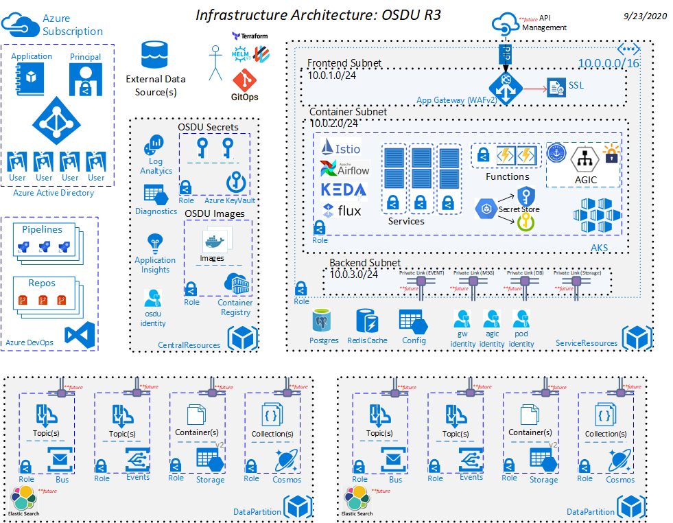

# Azure OSDU R3 MVP Architecture supporting Data Partitions

The `osdu` - R3 MVP Architecture solution template is intended to provision Managed Kubernetes resources like AKS and other core OSDU cloud managed services like Cosmos, Blob Storage and Keyvault. 

We decided to create another configuration that will support data partitions due to the complexity of migrating the osdu-r3-resources architecture to support data partitions without incurring a lot of breaking changes.

## Use-Case

### 1. Bring your own service principal (BYO)
In this setup, we operate with two Service principals. One SP used by terraform, and another one should be created for service_resources.
The use-case describes two options for creating a Service Principal needed for service_resources:
- Option 1: Use "Bring your own service principal (BYO)":
    - The system allows a service principal created in an alternate manner to be provided and used. In this case, we don't have to create SP automatically which allows us not to give terraform extra permission to the Azure Active Directory and follow the principle of least privilege.
    - Means that terraform SP should not have AD permissions for creating another Service Principal.
    - One extra step is required to manually create SP in service_resources [Prerequisites](./service_resources/README.md#__PreRequisites__).
- Option 2: Don't use "Bring your own service principal (BYO)" and automatically create a new one.
    - The system should automatically create a Service Principal if one is not provided. It requires elevated permission to the Azure Active Directory.
    - Means that terraform SP should have extra AD permissions for creating another Service Principal.
    - No manual extra steps. Less secure.
> Using "Bring your own service principal (BYO)" is strongly recommended due to Security best practices.


### 2. Resource Tagging
All resources should have the ability to have a tag(s) applied to them by values set in the template terraform.tfvars.


### 3. Data Partition Key Vault Value Naming
Values for items hosted in a keyvault that are created by a Data Partition need to be prefixed with the datapartition name.


### 4. Event Grid Topic Naming
Event Grid topics are DNS unique name values.  To get the unique name the value needs to be looked up in KV.


### 5. Deployment Order
Central Resources are required to be provisioned before Service or Data Partition Resources


## Cloud Resource Architecture




## Intended audience

Cloud administrators who are versed with both Cobalt templating and Kubernetes.

## Prerequisites

1. Azure Subscription
1. An available Service Principal capable of creating resources.
1. Terraform and Go are locally installed
1. Azure Storage Account is [setup](https://docs.microsoft.com/en-us/azure/terraform/terraform-backend) to store Terraform state
1. Local environment variables are [setup](https://github.com/microsoft/cobalt/blob/f31aff95e7732efde96c91b2779e94e16c1d538e/docs/2_QUICK_START_GUIDE.md#step-3-setup-local-environment-variables)
1. Deployment Service Principal is granted Owner level role assignment for the target Azure subscription

1. Enroll as an Azure subscriber. The free trial subscription does not support enough cores to run this tutorial.
1. Terraform `common_resources` environment module is [provisoned](environments/common_resources/README.md) to your Azure Environment
1. Terraform `data_resources` environment module is [provisoned](environments/data_resources/README.md) to your Azure Environment
1. Install the required common tools (kubectl, helm, and terraform). See also [Required Tools](https://github.com/microsoft/bedrock/tree/master/cluster). Note: this tutorial currently uses [Terraform 0.12.28](https://releases.hashicorp.com/terraform/0.12.28/).

## Cost

Azure environment cost ballpark [estimate](). This is subject to change and is driven from the resource pricing tiers configured when the template is deployed.

### Install the required tooling

This document assumes one is running a current version of Ubuntu. Windows users can install the [Ubuntu Terminal](https://www.microsoft.com/store/productId/9NBLGGH4MSV6) from the Microsoft Store. The Ubuntu Terminal enables Linux command-line utilities, including bash, ssh, and git that will be useful for the following deployment. _Note: You will need the Windows Subsystem for Linux installed to use the Ubuntu Terminal on Windows_.

Ensure that the [required tools](https://github.com/microsoft/bedrock/tree/master/cluster#required-tools), are installed in your environment. Alternatively, there are [scripts](https://github.com/microsoft/bedrock/tree/master/tools/prereqs) that will install `helm`, `terraform` and `kubectl`. In this case, use `setup_kubernetes_tools.sh` and `setup_terraform.sh`. The scripts install the tools into `/usr/local/bin`.

### Install the Azure CLI

For information specific to your operating system, see the [Azure CLI install guide](https://docs.microsoft.com/en-us/cli/azure/install-azure-cli?view=azure-cli-latest). You can also use [this script](https://github.com/microsoft/bedrock/blob/master/tools/prereqs/setup_azure_cli.sh) if running on a Unix based machine.


# Set Up Flux Manifest Repository

We will deploy the Bedrock environment using the empty repo and then add a Kubernetes manifest that defines a simple Web application. The change to the repo will automatically update the deployment.

To prepare the Flux manifest repository, we must:

1. [Create the Flux Manifest Repository](#create-the-flux-manifest-repository)
2. [Generate an RSA Key Pair to use as the Manifest Repository Deploy Key](#generate-an-rsa-key-pair-to-use-as-the-manifest-repository-deploy-key)
3. [Grant Deploy Key access to the Manifest Repository](#grant-deploy-key-access-to-the-manifest-repository)

## Create the Flux Manifest Repository

[Create an empty git repository](https://docs.microsoft.com/en-us/azure/devops/repos/git/create-new-repo?view=azure-devops) with a name that clearly signals that the repo is used for the Flux manifests. For example `bedrock-deploy-demo`.

Flux requires that the git repository have at least one commit. Initialize the repo with an empty commit.

```bash
git commit --allow-empty -m "Initializing the Flux Manifest Repository"
```

## Generate an RSA Key Pair to use as the Manifest Repository Deploy Key

Generate the [deploy key](https://developer.github.com/v3/guides/managing-deploy-keys/#deploy-keys) using `ssh-keygen`. The public portion of the key pair will be uploaded to GitHub as a deploy key.

```bash
AZURE_VAULT=<common_vault_name>
KEY_NAME=gitops-ssh-key

# Generate gitops-ssh-key
ssh-keygen -b 4096 -t rsa -f $KEY_NAME

# Save gitops-ssh-key
az keyvault secret set --vault-name $AZURE_VAULT -n "${KEY_NAME}" -f "${KEY_NAME}"
az keyvault secret set --vault-name $AZURE_VAULT -n "${KEY_NAME}-pub" -f "${KEY_NAME}.pub"

# Show Public gitops-ssh-key
az keyvault secret show --vault-name $AZURE_VAULT -n "${KEY_NAME}-pub" --query value -otsv
```


This will create public and private keys for the Flux repository. We will assign the public key under the following heading: [Adding the Repository Key](#adding-the-repository-key). The private key is stored on the machine originating the deployment.


## Create an RSA Key Pair to use as Node Key

The Terraform scripts use this node key to setup log-in credentials on the nodes in the AKS cluster. We will use this key when setting up the Terraform deployment variables. Generate the Node Key:

```bash
AZURE_VAULT=<common_vault_name>
KEY_NAME=node-ssh-key

# Generate node-ssh-key
ssh-keygen -b 4096 -t rsa -f $KEY_NAME

# Save node-ssh-key
az keyvault secret set --vault-name $AZURE_VAULT -n "${KEY_NAME}" -f "${KEY_NAME}"
az keyvault secret set --vault-name $AZURE_VAULT -n "${KEY_NAME}-pub" -f "${KEY_NAME}.pub"

# Save Locally Public node-ssh-key
az keyvault secret show --vault-name $AZURE_VAULT -n "${KEY_NAME}-pub" --query value -otsv
```


### Configure Key Access in Manifest Repository

The public key of the [RSA key pair](#create-an-rsa-key-pair-for-a-deploy-key-for-the-flux-repository) previously created needs to be added as a deploy key. Note: _If you do not own the repository, you will have to fork it before proceeding_.

Use the contents of the Secret as shown above.


Next, in your Azure DevOPS Project, follow these [steps](https://docs.microsoft.com/en-us/azure/devops/repos/git/use-ssh-keys-to-authenticate?view=azure-devops&tabs=current-page#step-2--add-the-public-key-to-azure-devops-servicestfs) to add your public SSH key to your ADO environment.


# Deployment Steps

## Manual Deployment Process
Follow these steps if you wish to deploy manually without pipeline support.


### Configure GitOPS + Node SSH keys with Terraform Deployment

Download the required keys from the common Key Vault

```
AZURE_VAULT=<common_vault_name>

az keyvault secret show --vault-name $AZURE_VAULT -n "node-ssh-key-pub" --query value -otsv > ~/.ssh/node-ssh-key.pub
az keyvault secret show --vault-name $AZURE_VAULT -n "gitops-ssh-key" --query value -otsv > ~/.ssh/gitops-ssh-key
chmod 644 ~/.ssh/node-ssh-key.pub
chmod 600 ~/.ssh/gitops-ssh-key
```

Update your `.env` file with the paths to your public and private SSH keys for Node and GitOPS repo access.

```
TF_VAR_ssh_public_key_file=/home/$USER/.ssh/node-ssh-key.pub
TF_VAR_gitops_ssh_key_file=/home/$USER/.ssh/gitops-ssh-key
```

### Deploy Common Resources

Follow the directions in the [`central_resources`](./central_resources/README.md) environment.

### Deploy Data Resources

Follow the directions in the [`data_resources`](./data_partition/README.md) environment.

### Deploy Service Resources

Follow the directions in the [`service_resources`](./service_resources/README.md) environment.


## License

Copyright © Microsoft Corporation

Licensed under the Apache License, Version 2.0 (the "License");
you may not use this file except in compliance with the License.
You may obtain a copy of the License at

[http://www.apache.org/licenses/LICENSE-2.0](http://www.apache.org/licenses/LICENSE-2.0)

Unless required by applicable law or agreed to in writing, software
distributed under the License is distributed on an "AS IS" BASIS,
WITHOUT WARRANTIES OR CONDITIONS OF ANY KIND, either express or implied.
See the License for the specific language governing permissions and
limitations under the License.