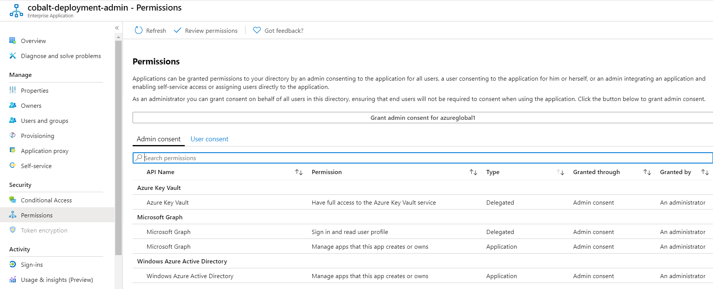

# Azure OSDU AKS Architecture Solution with Elastic Cloud SaaS

The `osdu` - Kubernetes Architecture solution template is intended to provision Managed Kubernetes resources like AKS and other core OSDU cloud managed services like Cosmos, Blob Storage and Keyvault. 

We decided to split these configuration files out into a separate Terraform environment templates to mitigate the risk of Terraform accidentally deleting stateful resources types as well as have a mechanism to duplicate environments to support concepts such as data partitioning or multiple AKS Clusters.


## Technical Design
Technical design [specifications](docs/aks-environment.md)

## GitOps Design
GitOps design [specifications](../../../docs/osdu/GITOPS_DESIGN.md).

## Cloud Resource Architecture


## Resource Topology


## Terraform Template Topology


## Intended audience

Cloud administrators who are versed with both Cobalt templating and Kubernetes.

## Prerequisites

1. Azure Subscription
1. An available Service Principal with API Permissions granted with Admin Consent within Azure app registration. The required Azure Active Directory Graph app role is `Application.ReadWrite.OwnedBy`

1. Terraform and Go are locally installed
1. Azure Storage Account is [setup](https://docs.microsoft.com/en-us/azure/terraform/terraform-backend) to store Terraform state
1. Local environment variables are [setup](https://github.com/microsoft/cobalt/blob/f31aff95e7732efde96c91b2779e94e16c1d538e/docs/2_QUICK_START_GUIDE.md#step-3-setup-local-environment-variables)
1. Deployment Service Principal is granted Owner level role assignment for the target Azure subscription

1. Enroll as an Azure subscriber. The free trial subscription does not support enough cores to run this tutorial.
1. Terraform `common_resources` environment module is [provisoned](environments/common_resources/README.md) to your Azure Environment
1. Terraform `data_resources` environment module is [provisoned](environments/data_resources/README.md) to your Azure Environment
1. Install the required common tools (kubectl, helm, and terraform). See also [Required Tools](https://github.com/microsoft/bedrock/tree/master/cluster). Note: this tutorial currently uses [Terraform 0.12.28](https://releases.hashicorp.com/terraform/0.12.28/).

## Cost

Azure environment cost ballpark [estimate](https://azure.com/e/61d8d0ef1644470c9c23d6d51796b4b7). This is subject to change and is driven from the resource pricing tiers configured when the template is deployed.

### Install the required tooling

This document assumes one is running a current version of Ubuntu. Windows users can install the [Ubuntu Terminal](https://www.microsoft.com/store/productId/9NBLGGH4MSV6) from the Microsoft Store. The Ubuntu Terminal enables Linux command-line utilities, including bash, ssh, and git that will be useful for the following deployment. _Note: You will need the Windows Subsystem for Linux installed to use the Ubuntu Terminal on Windows_.

Ensure that the [required tools](https://github.com/microsoft/bedrock/tree/master/cluster#required-tools), are installed in your environment. Alternatively, there are [scripts](https://github.com/microsoft/bedrock/tree/master/tools/prereqs) that will install `helm`, `terraform` and `kubectl`. In this case, use `setup_kubernetes_tools.sh` and `setup_terraform.sh`. The scripts install the tools into `/usr/local/bin`.

### Install the Azure CLI

For information specific to your operating system, see the [Azure CLI install guide](https://docs.microsoft.com/en-us/cli/azure/install-azure-cli?view=azure-cli-latest). You can also use [this script](https://github.com/microsoft/bedrock/blob/master/tools/prereqs/setup_azure_cli.sh) if running on a Unix based machine.


# Set Up Flux Manifest Repository

We will deploy the Bedrock environment using the empty repo and then add a Kubernetes manifest that defines a simple Web application. The change to the repo will automatically update the deployment.

To prepare the Flux manifest repository, we must:

1. [Create the Flux Manifest Repository](#create-the-flux-manifest-repository)
2. [Generate an RSA Key Pair to use as the Manifest Repository Deploy Key](#generate-an-rsa-key-pair-to-use-as-the-manifest-repository-deploy-key)
3. [Grant Deploy Key access to the Manifest Repository](#grant-deploy-key-access-to-the-manifest-repository)

## Create the Flux Manifest Repository

[Create an empty git repository](https://docs.microsoft.com/en-us/azure/devops/repos/git/create-new-repo?view=azure-devops) with a name that clearly signals that the repo is used for the Flux manifests. For example `bedrock-deploy-demo`.

Flux requires that the git repository have at least one commit. Initialize the repo with an empty commit.

```bash
git commit --allow-empty -m "Initializing the Flux Manifest Repository"
```

## Generate an RSA Key Pair to use as the Manifest Repository Deploy Key

Generate the [deploy key](https://developer.github.com/v3/guides/managing-deploy-keys/#deploy-keys) using `ssh-keygen`. The public portion of the key pair will be uploaded to GitHub as a deploy key.

```bash
AZURE_VAULT=<common_vault_name>
KEY_NAME=gitops-ssh-key

# Generate gitops-ssh-key
ssh-keygen -b 4096 -t rsa -f $KEY_NAME

# Save gitops-ssh-key
az keyvault secret set --vault-name $AZURE_VAULT -n "${KEY_NAME}" -f "${KEY_NAME}"
az keyvault secret set --vault-name $AZURE_VAULT -n "${KEY_NAME}-pub" -f "${KEY_NAME}.pub"

# Show Public gitops-ssh-key
az keyvault secret show --vault-name $AZURE_VAULT -n "${KEY_NAME}-pub" --query value -otsv
```


This will create public and private keys for the Flux repository. We will assign the public key under the following heading: [Adding the Repository Key](#adding-the-repository-key). The private key is stored on the machine originating the deployment.


## Create an RSA Key Pair to use as Node Key

The Terraform scripts use this node key to setup log-in credentials on the nodes in the AKS cluster. We will use this key when setting up the Terraform deployment variables. Generate the Node Key:

```bash
AZURE_VAULT=<common_vault_name>
KEY_NAME=node-ssh-key

# Generate node-ssh-key
ssh-keygen -b 4096 -t rsa -f $KEY_NAME

# Save node-ssh-key
az keyvault secret set --vault-name $AZURE_VAULT -n "${KEY_NAME}" -f "${KEY_NAME}"
az keyvault secret set --vault-name $AZURE_VAULT -n "${KEY_NAME}-pub" -f "${KEY_NAME}.pub"

# Save Locally Public node-ssh-key
az keyvault secret show --vault-name $AZURE_VAULT -n "${KEY_NAME}-pub" --query value -otsv
```


### Configure Key Access in Manifest Repository

The public key of the [RSA key pair](#create-an-rsa-key-pair-for-a-deploy-key-for-the-flux-repository) previously created needs to be added as a deploy key. Note: _If you do not own the repository, you will have to fork it before proceeding_.

Use the contents of the Secret as shown above.


Next, in your Azure DevOPS Project, follow these [steps](https://docs.microsoft.com/en-us/azure/devops/repos/git/use-ssh-keys-to-authenticate?view=azure-devops&tabs=current-page#step-2--add-the-public-key-to-azure-devops-servicestfs) to add your public SSH key to your ADO environment.


# Deployment Steps

## Manual Deployment Process
Follow these steps if you wish to deploy manually without pipeline support.


### Configure GitOPS + Node SSH keys with Terraform Deployment

Download the required keys from the common Key Vault

```
AZURE_VAULT=<common_vault_name>

az keyvault secret show --vault-name $AZURE_VAULT -n "node-ssh-key-pub" --query value -otsv > ~/.ssh/node-ssh-key.pub
az keyvault secret show --vault-name $AZURE_VAULT -n "gitops-ssh-key" --query value -otsv > ~/.ssh/gitops-ssh-key
chmod 644 ~/.ssh/node-ssh-key.pub
chmod 600 ~/.ssh/gitops-ssh-key
```

Update your `.env` file with the paths to your public and private SSH keys for Node and GitOPS repo access.

```
TF_VAR_ssh_public_key_file=/home/$USER/.ssh/node-ssh-key.pub
TF_VAR_gitops_ssh_key_file=/home/$USER/.ssh/gitops-ssh-key
```

### Deploy Common Resources

Follow the directions in the [`common_resources`](./configurations/common_resources/README.md) environment.

### Deploy Data Resources

Follow the directions in the [`data_resources`](./configurations/data_resources/README.md) environment.

### Deploy Service Resources

Follow the directions in the [`service_resources`](./configurations/cluster_resources/README.md) environment.


## Pipeline Deployment Process
Follow these steps if you wish to setup and deploy using ADO Pipelines.


### Configure Azure DevOps Service Connection

- Configure an [ARM Resources Service Connection](https://docs.microsoft.com/en-us/azure/devops/pipelines/library/connect-to-azure?view=azure-devops)
with name `osdu-infrastructure` for the desired subscription.
> ADO -> Project Settings -> Service Connection -> New service connection -> Azure Resource Manager -> Service principal (automatic)

  - Scope should be to the desired Subscription but do not apply scope to a Resource Group

- Locate the Service Principal created (<organization-project-subscription>) in Azure Active Directory and elevate the principal capability by adding in 2 API Permissions
  - Azure Active Directory Graph - Application.ReadWrite.OwnedBy
  - Microsoft Graph - Application.ReadWrite.OwnedBy

> These 2 API's require `Grant Admin Consent`


### Elastic Search Setup

Infrastructure assumes bring your own Elastic Search Instance at a version of `6.8.x` and access information must be stored in a Common KeyVault for ADO Libraries to access.


```bash
AZURE_VAULT="<your_keyvault>"
az keyvault secret set --vault-name $AZURE_VAULT --name "elastic-endpoint-osdu-r3-env" --value <your_es_endpoint>
az keyvault secret set --vault-name $AZURE_VAULT --name "elastic-username-osdu-r3-env" --value <your_es_username>
az keyvault secret set --vault-name $AZURE_VAULT --name "elastic-password-osdu-r3-env" --value <your_es_password>

# This command will extract all Key Vault Secrets
for i in `az keyvault secret list --vault-name $AZURE_VAULT --query [].id -otsv`
do
   echo "export ${i##*/}=\"$(az keyvault secret show --vault-name $AZURE_VAULT --id $i --query value -otsv)\""
done

```
> The Elastic endpoint provided should include `https` and the appropriate port number. A `http` endpoint will only work if services are properly configured to bypass the `https` requirement. 


### Setup ADO required Libraries

- Setup and Configure the ADO Library `Infrastructure Pipeline Variables`

  | Variable | Value |
  |----------|-------|
  | AGENT_POOL | Hosted Ubuntu 1604 |
  | BUILD_ARTIFACT_NAME | osdu-infrastructure |
  | SERVICE_CONNECTION_NAME | osdu-infrastructure |
  | TF_VAR_elasticsearch_secrets_keyvault_name | osducommon<your_unique>-kv |
  | TF_VAR_elasticsearch_secrets_keyvault_resource_group | osdu-common-<your_unique> |
  | TF_VAR_remote_state_account | osducommon<your_unique> |
  | TF_VAR_remote_state_container | remote-state-container |

- Setup and Configure the ADO Library `Infrastructure Pipeline Variables - env`

  | Variable | Value |
  |----------|-------|
  | ARM_SUBSCRIPTION_ID | <your_subscription_id> |
  | TF_VAR_aks_agent_vm_count | 3 |
  | TF_VAR_common_resources_workspace_name | cr-env |
  | TF_VAR_cosmosdb_replica_location | eastus2 |
  | TF_VAR_data_resources_workspace_name | dr-env |
  | TF_VAR_elasticsearch_version | 6.8.12 |
  | TF_VAR_gitops_branch | master |
  | TF_VAR_gitops_ssh_url | git@<your_flux_manifest_repo> |
  | TF_VAR_resource_group_location | centralus |

> You can specify the desired region locations you wish. Change the Elastic version as required.

- Setup and Configure the ADO Library `Infrastructure Pipeline Secrets - env`

  | Variable | Value |
  |----------|-------|
  | elastic-endpoint-osdu-r3-env | `*********` |
  | elastic-username-osdu-r3-env | `*********` |
  | elastic-password-osdu-r3-env | `*********` |

> This should be linked Secrets from Azure Key Vault `osducommon<your_unique>-kv`

- Setup 2 Secure Files
  - azure-aks-gitops-ssh-key
  - azure-aks-node-ssh-key.pub

> These files were created above.

- Add a Pipeline __osdu-infrastructure-r3-common__ -->  `azure-pipeline-common.yml` and execute it.

- Add a Pipeline __osdu-infrastructure-r3-data__ -->  `azure-pipeline-data.yml` and execute it.

- Add a Pipeline __osdu-infrastructure-r3-services__ -->  `azure-pipeline-services.yml` and execute it.

- Once Infrastructure is deployed grant admin_consent to the Service Principal.


## Interact with the Deployed Cluster

After `terraform apply` finishes for the cluster_resources, there is one critical output artifact: the Kubernetes config file for the deployed cluster that is generated and saved in the output directory. The default file is output/bedrock_kube_config. The following steps use this file to interact with the deployed Bedrock AKS cluster.

_Alternately context can be set with the following command `az aks get-credentials -g <ResourceGroup> -n <ClusterName>`_

Once the context is properly set, one of the first things we can do is list all namespaces used within the cluster:

```bash
$ kubectl get namespaces

NAME              STATUS   AGE
agic              Active   19d
cert-manager      Active   5d15h
default           Active   19d
flux              Active   19d
keda              Active   12d
kube-node-lease   Active   19d
kube-public       Active   19d
kube-system       Active   19d
kvsecrets         Active   19d
osdu              Active   19d
podidentity       Active   19d
```

Or view all the pods running by default within the cluster:

```bash
$ kubectl get po --all-namespaces

NAMESPACE      NAME                                                READY   STATUS    RESTARTS   AGE
agic           agic-ingress-azure-7b88b4b69f-p9n5w                 1/1     Running   0          19d
cert-manager   jetstack-cert-manager-567bb678c7-sjmct              1/1     Running   0          5d15h
cert-manager   jetstack-cert-manager-cainjector-695d847cdd-l2rv6   1/1     Running   0          5d15h
cert-manager   jetstack-cert-manager-webhook-5b895bb689-dvwvd      1/1     Running   0          5d15h
flux           flux-6899458bb8-qghrq                               1/1     Running   9          19d
flux           flux-memcached-8647794c5f-slsvr                     1/1     Running   0          19d
keda           keda-operator-5895ff46b9-fh5xn                      1/1     Running   0          7d20h
keda           keda-operator-metrics-apiserver-6774776dbc-jwg7q    1/1     Running   0          12d
kube-system    azure-cni-networkmonitor-745vs                      1/1     Running   0          19d
kube-system    azure-cni-networkmonitor-9kq6c                      1/1     Running   0          19d
kube-system    azure-cni-networkmonitor-dt7ch                      1/1     Running   0          19d
kube-system    azure-ip-masq-agent-6kv6v                           1/1     Running   0          19d
kube-system    azure-ip-masq-agent-p6zxn                           1/1     Running   0          19d
kube-system    azure-ip-masq-agent-vw7fr                           1/1     Running   0          19d
kube-system    azure-npm-f9qz7                                     1/1     Running   0          14d
kube-system    azure-npm-j6qdv                                     1/1     Running   0          14d
kube-system    azure-npm-vkghz                                     1/1     Running   0          14d
kube-system    coredns-869cb84759-69nmv                            1/1     Running   0          19d
kube-system    coredns-869cb84759-fvpf8                            1/1     Running   0          19d
kube-system    coredns-autoscaler-5b867494f-wvt6q                  1/1     Running   11         19d
kube-system    dashboard-metrics-scraper-7dbbb6996d-4v6m4          1/1     Running   0          19d
kube-system    kube-proxy-4qmfg                                    1/1     Running   0          19d
kube-system    kube-proxy-b66qd                                    1/1     Running   0          19d
kube-system    kube-proxy-wwts4                                    1/1     Running   0          19d
kube-system    kubernetes-dashboard-5596bdb9f-cx4bw                1/1     Running   8          19d
kube-system    metrics-server-6cd7558856-lvqrg                     1/1     Running   0          19d
kube-system    omsagent-4g9qf                                      1/1     Running   0          19d
kube-system    omsagent-j8v77                                      1/1     Running   0          19d
kube-system    omsagent-rs-764c6f8d8-54fjd                         1/1     Running   0          19d
kube-system    omsagent-zg2wh                                      1/1     Running   0          19d
kube-system    tunnelfront-7cfc889c77-gh9jv                        2/2     Running   1          19d
kvsecrets      kvsecrets-csi-secrets-store-provider-azure-ddnwn    1/1     Running   0          19d
kvsecrets      kvsecrets-csi-secrets-store-provider-azure-j2m7x    1/1     Running   0          19d
kvsecrets      kvsecrets-csi-secrets-store-provider-azure-sszrt    1/1     Running   0          19d
kvsecrets      kvsecrets-secrets-store-csi-driver-92n8k            3/3     Running   0          19d
kvsecrets      kvsecrets-secrets-store-csi-driver-pnx8x            3/3     Running   0          19d
kvsecrets      kvsecrets-secrets-store-csi-driver-vmg48            3/3     Running   0          19d
podidentity    aad-pod-identity-mic-57dbd9f4fb-bd4vr               1/1     Running   12         19d
podidentity    aad-pod-identity-mic-57dbd9f4fb-zj6lb               1/1     Running   0          19d
podidentity    aad-pod-identity-nmi-fmjlk                          1/1     Running   0          19d
podidentity    aad-pod-identity-nmi-qk2t4                          1/1     Running   0          19d
podidentity    aad-pod-identity-nmi-vtxmg                          1/1     Running   0          19d
```

Note that there is a namespace flux. As previously mentioned, Flux is managing the deployment of all of the resources into the cluster. Taking a look at the description for the flux pod flux-6899458bb8-qghrq, we see the following:

```bash
$ kubectl describe po/flux-6899458bb8-qghrq --namespace=flux

Name:         flux-6899458bb8-qghrq
Namespace:    flux
Priority:     0
Node:         aks-default-27739138-vmss000001/10.10.2.35
Start Time:   Thu, 06 Aug 2020 12:31:42 -0500
Labels:       app=flux
              pod-template-hash=6899458bb8
              release=flux
Annotations:  <none>
Status:       Running
IP:           10.10.2.49
IPs:
  IP:           10.10.2.49
Controlled By:  ReplicaSet/flux-6899458bb8
Containers:
  flux:
    Container ID:  docker://f812201502ed64166239537ba34aad9c0dad1f338eefd7a93f83aee02b35d177
    Image:         docker.io/fluxcd/flux:1.18.0
    Image ID:      docker-pullable://fluxcd/flux@sha256:8fcf24dccd7774b87a33d87e42fa0d9233b5c11481c8414fe93a8bdc870b4f5b
    Port:          3030/TCP
    Host Port:     0/TCP
    Args:
      --log-format=fmt
      --ssh-keygen-dir=/var/fluxd/keygen
      --k8s-secret-name=flux-ssh
      --memcached-hostname=flux-memcached
      --sync-state=git
      --memcached-service=
      --git-url=git@ssh.dev.azure.com:v3/osdu-demo/OSDU_Rx/k8-gitops-manifests
      --git-branch=dascholl
      --git-path=providers/azure/hld-registry
      --git-readonly=false
      --git-user=Weave Flux
      --git-email=support@weave.works
      --git-verify-signatures=false
      --git-set-author=false
      --git-poll-interval=10s
      --git-timeout=20s
      --sync-interval=10s
      --git-ci-skip=false
      --git-label=flux-sync
      --automation-interval=5m
      --registry-rps=200
      --registry-burst=125
      --registry-trace=false
      --sync-garbage-collection=true
    State:          Running
      Started:      Sat, 22 Aug 2020 20:39:16 -0500
    Last State:     Terminated
      Reason:       Completed
      Exit Code:    0
      Started:      Thu, 20 Aug 2020 22:40:42 -0500
      Finished:     Sat, 22 Aug 2020 20:39:16 -0500
    Ready:          True
    Restart Count:  9
    Requests:
      cpu:      50m
      memory:   64Mi
    Liveness:   http-get http://:3030/api/flux/v6/identity.pub delay=5s timeout=5s period=10s #success=1 #failure=3
    Readiness:  http-get http://:3030/api/flux/v6/identity.pub delay=5s timeout=5s period=10s #success=1 #failure=3
    Environment:
      KUBECONFIG:  /root/.kubectl/config
    Mounts:
      /etc/fluxd/ssh from git-key (ro)
      /etc/kubernetes/azure.json from acr-credentials (ro)
      /root/.kubectl from kubedir (rw)
      /var/fluxd/keygen from git-keygen (rw)
      /var/run/secrets/kubernetes.io/serviceaccount from flux-token-9vg9f (ro)
Conditions:
  Type              Status
  Initialized       True 
  Ready             True 
  ContainersReady   True 
  PodScheduled      True 
Volumes:
  kubedir:
    Type:      ConfigMap (a volume populated by a ConfigMap)
    Name:      flux-kube-config
    Optional:  false
  git-key:
    Type:        Secret (a volume populated by a Secret)
    SecretName:  flux-ssh
    Optional:    false
  git-keygen:
    Type:       EmptyDir (a temporary directory that shares a pod's lifetime)
    Medium:     Memory
    SizeLimit:  <unset>
  acr-credentials:
    Type:          HostPath (bare host directory volume)
    Path:          /etc/kubernetes/azure.json
    HostPathType:  
  flux-token-9vg9f:
    Type:        Secret (a volume populated by a Secret)
    SecretName:  flux-token-9vg9f
    Optional:    false
QoS Class:       Burstable
Node-Selectors:  beta.kubernetes.io/os=linux
Tolerations:     node.kubernetes.io/not-ready:NoExecute for 300s
                 node.kubernetes.io/unreachable:NoExecute for 300s
Events:          <none>
```

## Continuous Deployment

Flux automation makes it easy to upgrade services or infrastructure. In this example Flux watches the repo we set up previously under the heading [Set Up Flux Manifest Repository](#set-up-flux-manifest-repository). Now we add a simple Web application to the running deployment by pushing a .yaml manifest to the repo. The .yaml specification describes the default-service and a Deployment. It specifies the source the Docker image that contains it: image: neilpeterson/aks-helloworld:v1 and how many containers to run: replicas: 1. 

When the .yaml file is complete we will push it to the repo, or simply drop it on GitHub. Flux is querying the repo for changes and will deploy the new service replicas as defined by this manifest.

Create the following .yaml file and name it default-service.

```yaml
apiVersion: v1
kind: Service
metadata:
  name: default-service
  namespace: osdu
  labels:
    app: default-service
spec:
  type: ClusterIP
  ports:
    - port: 80
  selector:
    app: default-service
---
apiVersion: apps/v1
kind: Deployment
metadata:
  name: default-service
  namespace: osdu
spec:
  selector:
    matchLabels:
      app: default-service
  replicas: 1
  template:
    metadata:
      labels:
        app: default-service
    spec:
      containers:
        - name: default-service
          image: neilpeterson/aks-helloworld:v1
          ports:
            - containerPort: 80
          env:
            - name: TITLE
              value: "Azure OSDU Platform - (AKS)"
```

To see the changes as Flux picks them up and deploys them, you can monitor the logs from the flux container.

```
$ kubectl logs -f  flux-6899458bb8-qghrq --namespace=flux
```

Now, push or drop the default-service.yaml file to the empty repo created under the previous heading [Set Up Flux Manifest Repository](#set-up-flux-manifest-repository). You can click `Upload files` on the GitHub repo page and drop the .yaml file:

Flux has connected to the repo and created the new service and deployment: `"kubectl apply -f -" took=1.591333771s err=null output="service/default-service created\ndeployment.apps/default-service created"`.

Now you can view the service deployed in the `osdu` namespace.

```bash
$ kubectl get services --namespace=osdu

NAME              TYPE        CLUSTER-IP    EXTERNAL-IP   PORT(S)   AGE
default-service   ClusterIP   10.0.212.75   <none>        80/TCP    117s


$ kubectl get deployments --namespace=osdu

NAME              READY   UP-TO-DATE   AVAILABLE   AGE
default-service   1/1     1            1           2m11s


$ kubectl get pods --namespace=osdu

NAME                               READY   STATUS    RESTARTS   AGE
default-service-86cd47b748-sc7bv   1/1     Running   0          2m19s
```

Finally we can connect directly to the pod and validate the service is properly running.

```bash
$ kubectl port-forward default-service-86cd47b748-sc7bv 8080:80

Forwarding from 127.0.0.1:8080 -> 80
Forwarding from [::1]:8080 -> 80
```

View the service in a browser http://localhost:8080

> To delete the service take the default-service.yaml and remove it from the manfiest repo and flux will perform the uninstall.


## Manually Install OSDU on Azure using a Helm Chart

Perform the following procedure from the `devops` directory.

1. Download [helm-config.yaml](https://raw.githubusercontent.com/Azure/osdu-infrastructure/master/devops/helm-config.yaml), which will configure OSDU on Azure.

```bash
wget https://raw.githubusercontent.com/Azure/osdu-infrastructure/master/devops/helm-config.yaml -O config.yaml
```

2. Edit the newly downloaded [helm-config.yaml](https://raw.githubusercontent.com/Azure/osdu-infrastructure/master/devops/helm-config.yaml) and fill out the sections `azure` and `ingress`.

3. Install the osdu on azure charts.

```bash
# Full Install
helm install -f config.yaml osdu-current osdu-azure
```

4. Uninstall the osdu on azure charts.

```
helm uninstall osdu-current
```

## Kubernetes Portal Dashboard

Kubernetes includes a web dashboard that can be used for basic management operations. This dashboard lets you view basic health status and metrics for your applications, create and deploy services, and edit existing applications.

```bash
$ kubectl create clusterrolebinding kubernetes-dashboard --clusterrole=cluster-admin --serviceaccount=kube-system:kubernetes-dashboard

$ az aks browse --resource-group myResourceGroup --name myAKSCluster
The behavior of this command has been altered by the following extension: aks-preview
Merged "devint-aks-mgf9wjxt-osdu-r2-aks" as current context in /tmp/tmps6_a6amm
Proxy running on http://127.0.0.1:8001/
Press CTRL+C to close the tunnel...
```


## Infrastructure Integration Testing

Please confirm that you've completed the `terraform apply` step before running the integration tests as we're validating the active terraform workspace.

Integration tests can be run using the following command:

```
go test -v $(go list ./... | grep "integration")
```

## Infrastructure Terraform Destroy 

Optionally execute the following command to teardown your deployment and delete your resources.

```bash
# Destroy resources and tear down deployment. Only do this if you want to destroy your deployment.
terraform destroy
```

## License
Copyright © Microsoft Corporation

Licensed under the Apache License, Version 2.0 (the "License");
you may not use this file except in compliance with the License.
You may obtain a copy of the License at 

[http://www.apache.org/licenses/LICENSE-2.0](http://www.apache.org/licenses/LICENSE-2.0)

Unless required by applicable law or agreed to in writing, software
distributed under the License is distributed on an "AS IS" BASIS,
WITHOUT WARRANTIES OR CONDITIONS OF ANY KIND, either express or implied.
See the License for the specific language governing permissions and
limitations under the License.
