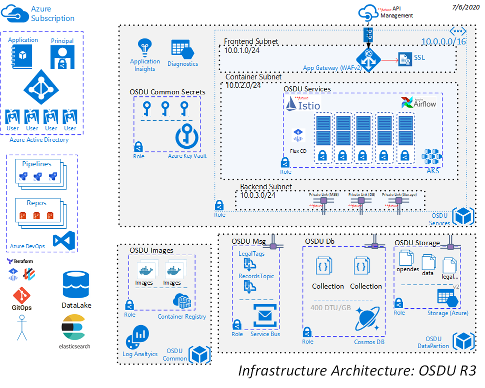
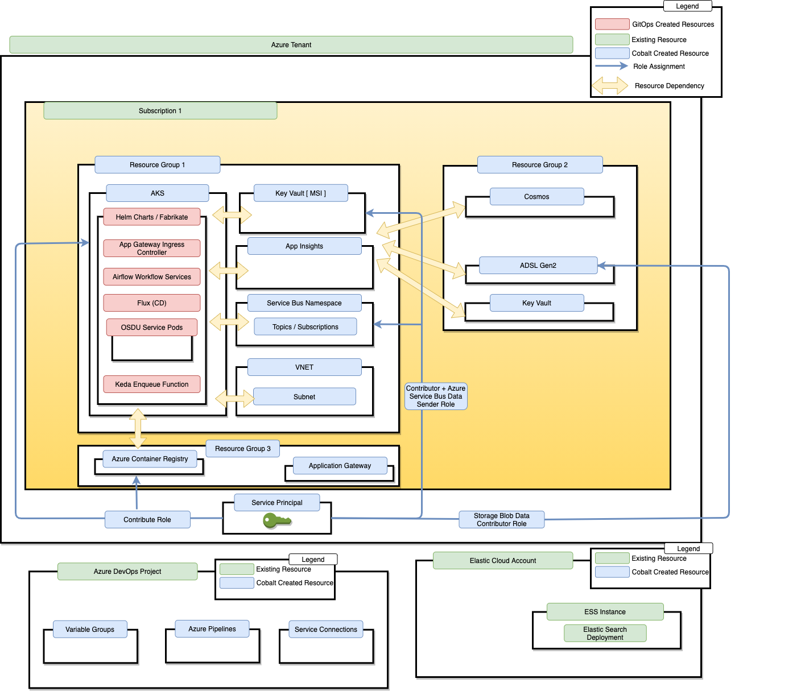

# Deploying OSDU services with Kubernetes + Elastic Cloud

v0.1 - 2/6/2020
v0.2 - 7/6/2020

## Introduction

Some of OSDU's enterprise customers have a small number of microservices they'd like to deploy and host on [AKS](https://docs.microsoft.com/en-us/azure/aks/). Geospatial documents are indexed in Elastic Search to accomodate bounding box and radius distance querying scenarios. This template provisions resources required to run OSDU Services in AKS and uses an instance of a fully managed PaaS Elasticsearch hosted in [EC](https://www.elastic.co/cloud/).

This document outlines how Cobalt has been extended to meet the use cases of these customers. The intended audience of this document is the development and product teams working on OSDU Infratructure on Azure and related projects.

## In Scope

- Diagram the architecture solution.
- Identify deployment topology needed
- Identify key Terraform templates needed for deployment
- Identify key Terraform modules needed for deployment
- Identify gaps in Terraform provider templates
- [Bedrock](https://github.com/microsoft/bedrock) integration
- How existing storage services like Elastic Cloud and Cosmos can be imported to reduce azure subscription incurred costs

## Out of scope

- Traffic Manager Integration
- APIM integration
- Istio integration

## Key Terms
- **RG**: Abbreviation for “Resource Group”
- **Sub**: Abbreviation for “Subscription”
- **Persona**: An archetype of a Cobalt customer
- **Stage**: An application deployment stage (dev, qa, pre-prod, prod, etc...)
- **Region**: A location in which an application is deployed


## Customers
- **Admin**: This persona represents an administrator of Azure. This persona does not implement the line of business applications but will help other teams deliver them.
- **App Developer Team**: This persona is responsible for creating and maintaining the line of business applications

## Solution Architecture

This drawing shows the intended Azure Solution Architecture necessary.



## Deployment Topology

This graphic shows the targeted deployment topology needed by our enterprise customers. The deployment is deployed to a single tenant and subscription. The resources are partitioned to align with the different personas within the customer.



## Template Topology

The graphic below outlines the topology of the terraform templates that will deploy the topology called out above.


## Terraform Template Environment Dependencies

```
└── environments
    ├── common_resources
    │   ├── main.tf
    │   └── terraform.tfvars
    ├── data_resources
    │   ├── main.tf
    │   ├── terraform.tfvars
    │   └── variables.tf
    ├── cluster_resources
    │   ├── agic.tf
    │   ├── aks.tf
    │   ├── backend.tf
    │   ├── commons.tf
    │   ├── keyvault.tf
    │   ├── networking.tf
    │   ├── outputs.tf
    │   ├── pod_identity.tf
    │   ├── security.tf
    │   ├── terraform.tfvars
    │   └── variables.tf
```
### data_resources

The [cluster_resources](../environments/cluster_resources/variables.tf) environment relies on the resources from the [data_resources](../environments/data_resources/variables.tf) environment as the data storage reference for blob storage and COSMOS. 

### common_resources

The [cluster_resources](../environments/cluster_resources/variables.tf) environment relies on the resources from the [common_resources](../environments/common_resources/variables.tf) environment to source all docker images deployed to the AKS cluster.

## Template Inputs
Supported arguments for the aks environment are available in [variables.tf](../environments/cluster_resources/variables.tf).

### Credential Management

The AKS cluster will be configured with a `SystemAssigned` identity to enable MSI integration with resources like Service Bus, ADLS Gen 2 and Keyvault. 

MSI is enabled through the [identity block](https://www.terraform.io/docs/providers/azurerm/r/kubernetes_cluster.html#type-2) of the `azurerm_kubernetes_cluster` Terraform provider.

You can reference the AKS MI [docs](https://docs.microsoft.com/en-us/azure/aks/use-managed-identity) for manual setup instructions.

## Security

Here is an overview of the security for the deployment strategy and templates discussed above:

- **Role Assignments**: The service principal running the deployment will have to be an owner in the target subscription and granted admin consent to the `Application.ReadWrite.OwnedBy` role in Microsoft Graph. This template creates a new service principal that will be available for application developer team(s) to administer the provisioned Azure resources. The following role assignments will be made to that service principal:
  - Contributor access to AKS & App Insights in the first Resource Group


## License
Copyright © Microsoft Corporation

Licensed under the Apache License, Version 2.0 (the "License");
you may not use this file except in compliance with the License.
You may obtain a copy of the License at 

[http://www.apache.org/licenses/LICENSE-2.0](http://www.apache.org/licenses/LICENSE-2.0)

Unless required by applicable law or agreed to in writing, software
distributed under the License is distributed on an "AS IS" BASIS,
WITHOUT WARRANTIES OR CONDITIONS OF ANY KIND, either express or implied.
See the License for the specific language governing permissions and
limitations under the License.