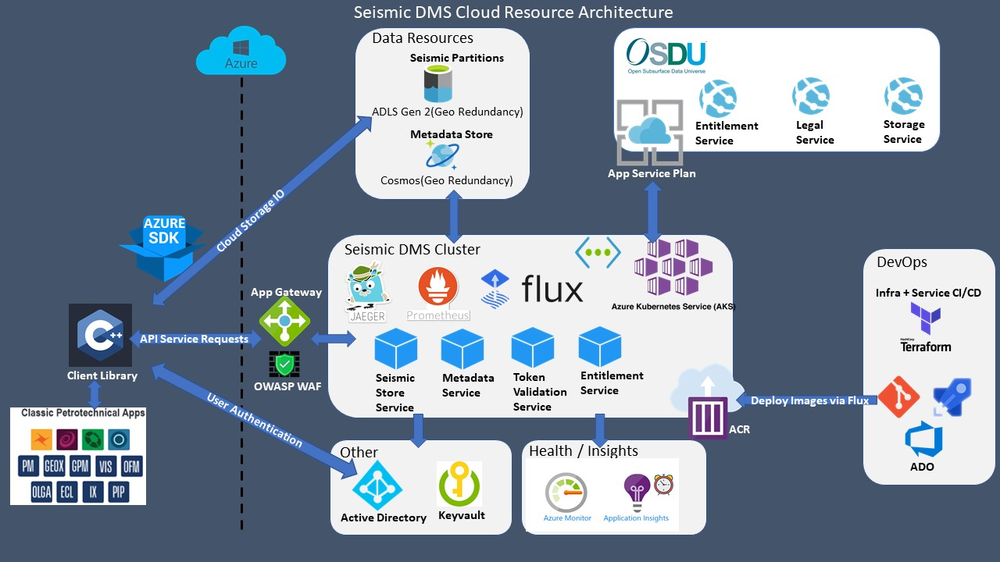
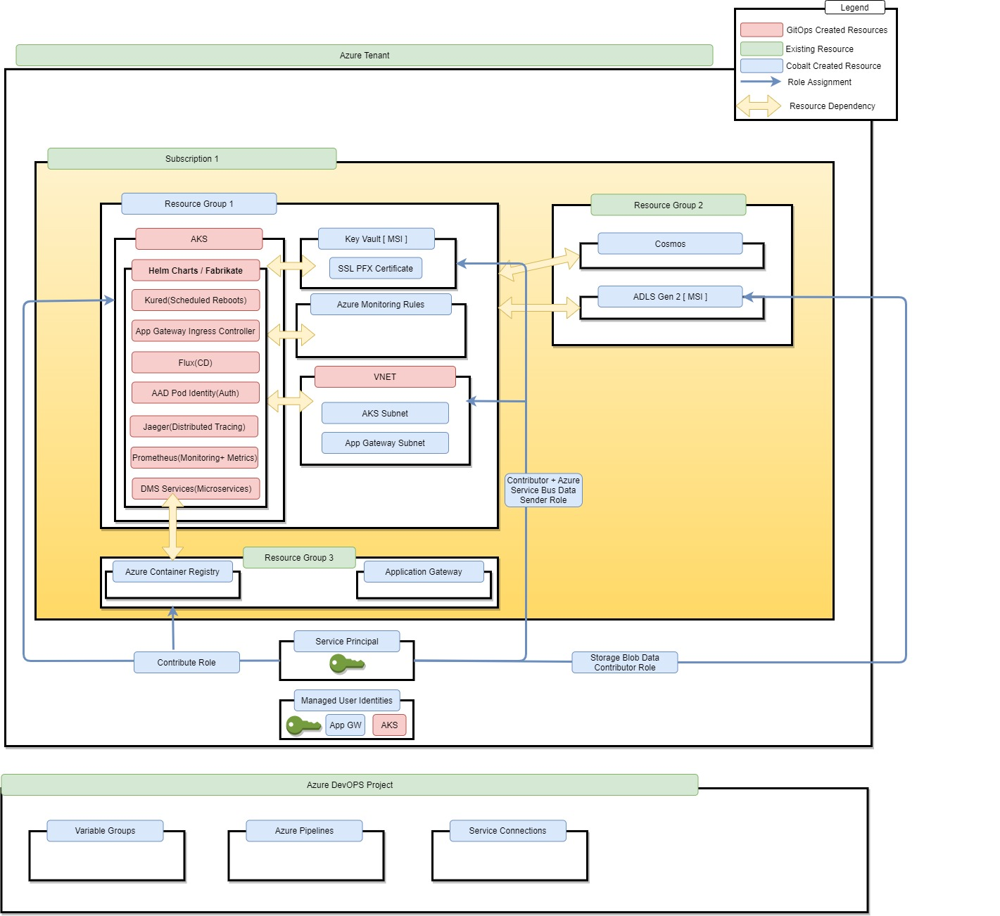
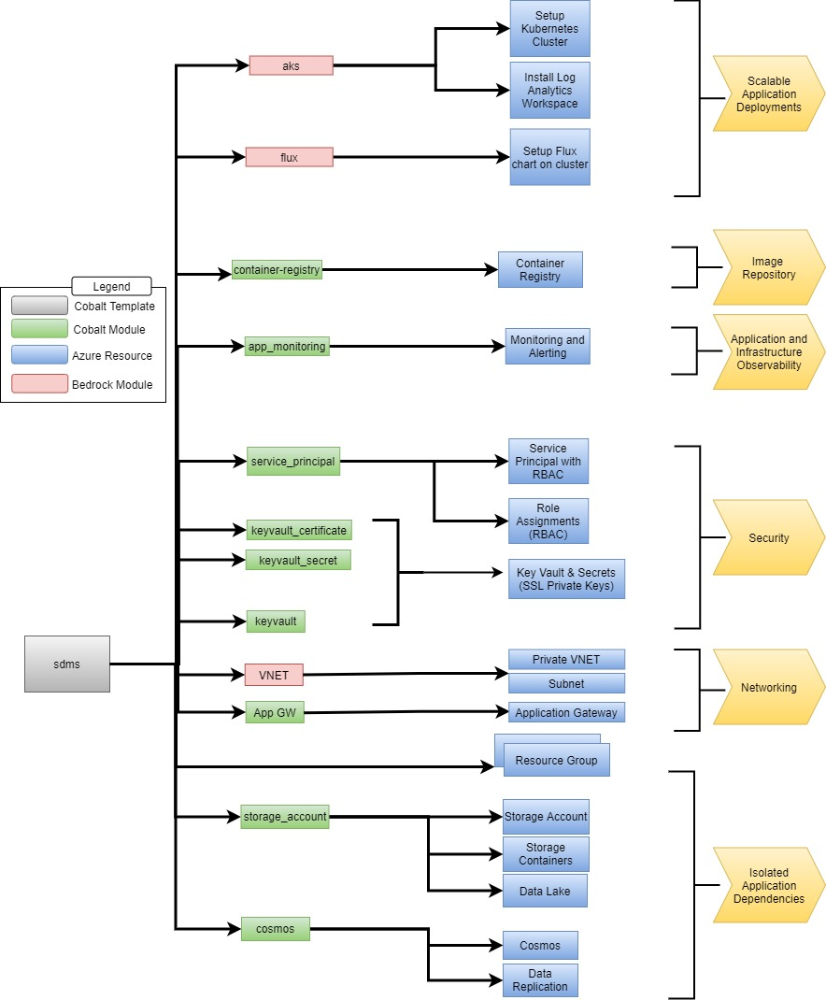

# Azure SDMS - Container Environment

The `sdms` - `container_cluster` environment template is intended to provision Managed Kubernetes resources like AKS and other core SDMS cloud managed services like Cosmos, Blob Storage and Keyvault. We decided to split these configuration files out into a separate Terraform module to mitigate the risk of Terraform accidentally deleting stateful resources types.

> *Have you completed the quick start guide? Deploy your first infrastructure as code project with Cobalt by following the [quick-start guide](https://github.com/microsoft/cobalt/blob/master/docs/2_QUICK_START_GUIDE.md).*

## Technical Design
Template design [specifications](../../docs/design/aks-environment.md).

## Cloud Resource Architecture



## Resource Topology



## Terraform Template Topology



## Intended audience

Cloud administrators who are versed with both Cobalt templating and Kubernetes.

## Prerequisites

1. Azure Subscription
1. An available Service Principal with API Permissions granted with Admin Consent within Azure app registration. The required Azure Active Directory Graph app role is `Application.ReadWrite.OwnedBy`

1. Terraform and Go are locally installed
1. Azure Storage Account is [setup](https://docs.microsoft.com/en-us/azure/terraform/terraform-backend) to store Terraform state
1. Local environment variables are [setup](https://github.com/microsoft/cobalt/blob/f31aff95e7732efde96c91b2779e94e16c1d538e/docs/2_QUICK_START_GUIDE.md#step-3-setup-local-environment-variables)
1. Deployment Service Principal is granted Owner level role assignment for the target Azure subscription

1. Enroll as an Azure subscriber. The free trial subscription does not support enough cores to run this tutorial.
1. Terraform `image_registry` environment module is [provisoned](../image_registry/README.md) to your Azure Environment
1. Terraform `data_sources` environment module is [provisoned](../data_sources/README.md) to your Azure Environment
1. Install the required common tools (kubectl, helm, and terraform). See also [Required Tools](https://github.com/microsoft/bedrock/tree/master/cluster). Note: this tutorial currently uses [Terraform 0.12.6](https://releases.hashicorp.com/terraform/0.12.6/).

### Install the required tooling

This document assumes one is running a current version of Ubuntu. Windows users can install the [Ubuntu Terminal](https://www.microsoft.com/store/productId/9NBLGGH4MSV6) from the Microsoft Store. The Ubuntu Terminal enables Linux command-line utilities, including bash, ssh, and git that will be useful for the following deployment. _Note: You will need the Windows Subsystem for Linux installed to use the Ubuntu Terminal on Windows_.

Ensure that the [required tools](https://github.com/microsoft/bedrock/tree/master/cluster#required-tools), are installed in your environment. Alternatively, there are [scripts](https://github.com/jmspring/bedrock-dev-env/tree/master/scripts) that will install `helm`, `terraform` and `kubectl`. In this case, use `setup_kubernetes_tools.sh` and `setup_terraform.sh`. The scripts install the tools into `/usr/local/bin`.

### Install the Azure CLI

For information specific to your operating system, see the [Azure CLI install guide](https://docs.microsoft.com/en-us/cli/azure/install-azure-cli?view=azure-cli-latest). You can also use [this script](https://github.com/jmspring/bedrock-dev-env/blob/master/scripts/setup_azure_cli.sh) if running on a Unix based machine.


# Set Up Flux Manifest Repository

We will deploy the Bedrock environment using the empty repo and then add a Kubernetes manifest that defines a simple Web application. The change to the repo will automatically update the deployment.

To prepare the Flux manifest repository, we must:

1. [Create the Flux Manifest Repository](#create-the-flux-manifest-repository)
2. [Generate an RSA Key Pair to use as the Manifest Repository Deploy Key](#generate-an-rsa-key-pair-to-use-as-the-manifest-repository-deploy-key)
3. [Grant Deploy Key access to the Manifest Repository](#grant-deploy-key-access-to-the-manifest-repository)

## Create the Flux Manifest Repository

[Create an empty git repository](https://docs.microsoft.com/en-us/azure/devops/repos/git/create-new-repo?view=azure-devops) with a name that clearly signals that the repo is used for the Flux manifests. For example `bedrock-deploy-demo`.

Flux requires that the git repository have at least one commit. Initialize the repo with an empty commit.

```bash
git commit --allow-empty -m "Initializing the Flux Manifest Repository"
```

## Generate an RSA Key Pair to use as the Manifest Repository Deploy Key

Generate the [deploy key](https://developer.github.com/v3/guides/managing-deploy-keys/#deploy-keys) using `ssh-keygen`. The public portion of the key pair will be uploaded to GitHub as a deploy key.

Run: `ssh-keygen -b 4096 -t rsa -f ~/.ssh/gitops-ssh-key`.

```bash
$ ssh-keygen -b 4096 -t rsa -f ~/.ssh/gitops-ssh-key
Generating public/private rsa key pair.
Enter passphrase (empty for no passphrase):
Enter same passphrase again:
Your identification has been saved in /Users/jmspring/.ssh/gitops-ssh-key.
Your public key has been saved in /Users/jmspring/.ssh/gitops-ssh-key.pub.
The key fingerprint is:
SHA256:jago9v63j05u9WoiNExnPM2KAWBk1eTHT2AmhIWPIXM jmspring@kudzu.local
The key's randomart image is:
+---[RSA 4096]----+
|.=o.B= +         |
|oo E..= .        |
|  + =..oo.       |
|   . +.*o=       |
|    o * S..      |
|   . * . .       |
|... o ... .      |
|...  .o+.. .     |
|  .o..===o.      |
+----[SHA256]-----+
kudzu:azure-simple jmspring$
```

This will create public and private keys for the Flux repository. We will assign the public key under the following heading: [Adding the Repository Key](#adding-the-repository-key). The private key is stored on the machine originating the deployment.

## Configure Key Access in ADO

The public key of the [RSA key pair](#create-an-rsa-key-pair-for-a-deploy-key-for-the-flux-repository) previously created needs to be added as a deploy key. Note: _If you do not own the repository, you will have to fork it before proceeding_.

First, display the contents of the public key: `more ~/.ssh/gitops-ssh-key.pub`.

```bash
$ more ~/.ssh/gitops-ssh-key.pub
ssh-rsa AAAAB3NzaC1yc2EAAAADAQABAAACAQDTNdGpnmztWRa8RofHl8dIGyNkEayNR6d7p2JtJ7+zMj0HRUJRc+DWvBML4DvT29AumVEuz1bsVyVS2f611NBmXHHKkbzAZZzv9gt2uB5sjnmm7LAORJyoBEodR/T07hWr8MDzYrGo5fdTDVagpoHcEke6JT04AL21vysBgqfLrkrtcEyE+uci4hRVj+FGL9twh3Mb6+0uak/UsTFgfDi/oTXdXOFIitQgaXsw8e3rkfbqGLbhb6o1muGd1o40Eip6P4xejEOuIye0cg7rfX461NmOP7HIEsUa+BwMExiXXsbxj6Z0TXG0qZaQXWjvZF+MfHx/J0Alb9kdO3pYx3rJbzmdNFwbWM4I/zN+ng4TFiHBWRxRFmqJmKZX6ggJvX/d3z0zvJnvSmOQz9TLOT4lqZ/M1sARtABPGwFLAvPHAkXYnex0v93HUrEi7g9EnM+4dsGU8/6gx0XZUdH17WZ1dbEP7VQwDPnWCaZ/aaG7BsoJj3VnDlFP0QytgVweWr0J1ToTRQQZDfWdeSBvoqq/t33yYhjNA82fs+bR/1MukN0dCWMi7MqIs2t3TKYW635E7VHp++G1DR6w6LoTu1alpAlB7d9qiq7o1c4N+gakXSUkkHL8OQbQBeLeTG1XtYa//A5gnAxLSzxAgBpVW15QywFgJlPk0HEVkOlVd4GzUw== sl;jlkjgl@kudzu.local
```

Next, in your Azure DevOPS Project, follow these [steps](https://docs.microsoft.com/en-us/azure/devops/repos/git/use-ssh-keys-to-authenticate?view=azure-devops&tabs=current-page#step-2--add-the-public-key-to-azure-devops-servicestfs) to add your public SSH key to your ADO environment.

## Create an RSA Key Pair to use as Node Key

The Terraform scripts use this node key to setup log-in credentials on the nodes in the AKS cluster. We will use this key when setting up the Terraform deployment variables. To generate the node key, run `ssh-keygen -b 4096 -t rsa -f ~/.ssh/node-ssh-key`:

```bash
$ ssh-keygen -b 4096 -t rsa -f ~/.ssh/node-ssh-key
Generating public/private rsa key pair.
Enter passphrase (empty for no passphrase):
Enter same passphrase again:
Your identification has been saved in /home/jims/.ssh/node-ssh-key.
Your public key has been saved in /home/jims/.ssh/node-ssh-key.pub.
The key fingerprint is:
SHA256:+8pQ4MuQcf0oKT6LQkyoN6uswApLZQm1xXc+pp4ewvs jims@fubu
The key's randomart image is:
+---[RSA 4096]----+
|   ...           |
|  . o. o .       |
|.. .. + +        |
|... .= o *       |
|+  ++ + S o      |
|oo=..+ = .       |
|++ ooo=.o        |
|B... oo=..       |
|*+. ..oEo..      |
+----[SHA256]-----+
```

## Configure GitOPS + Node SSH keys with Terraform Deployment

Update your `.env` file with the paths to your public and private SSH keys for Node and GitOPS repo access.

```
TF_VAR_ssh_public_key_file=/home/erikschlegel/.ssh/node-ssh-key.pub
TF_VAR_gitops_ssh_key_file=/home/erikschlegel/.ssh/gitops-ssh-key
```

# Deployment Steps

## Source your environment 

Execute the following commands to set up your local environment variables:

*Note for Windows Users using WSL*: We recommend running dos2unix utility on the environment file via `dos2unix .env` prior to sourcing your environment variables to chop trailing newline and carriage return characters.

```bash
# these commands setup all the environment variables needed to run this template
DOT_ENV=<path to your .env file>
export $(cat $DOT_ENV | xargs)
```

## Service Principal Login

Execute the following command to configure your local Azure CLI.

```bash
# This logs your local Azure CLI in using the configured service principal.
az login --service-principal -u $ARM_CLIENT_ID -p $ARM_CLIENT_SECRET --tenant $ARM_TENANT_ID
```

## Define Terraform Variables

Navigate to the `terraform.tfvars` terraform file. Here's a sample of the terraform.tfvars file for this template. Be sure to update the `gitops_ssh_url` TF var with the git url of the GitOPS repo.


```HCL
resource_group_location     = "centralus"
prefix                      = "osdu-r2"
acr_resource_group_name     = "osdu-r2-acr"
acr_container_registry_name = "osducr"
data_resource_prefix        = "data-dev-int-osdur2"
gitops_ssh_url              = "git@ssh.dev.azure.com:v3/slb-des-ext-collaboration/open-data-ecosystem/k8-gitops-hld"
sb_topics = []
```

## Initialize your workspace

Execute the following commands to set up your terraform workspace.

```bash
# This configures terraform to leverage a remote backend that will help you and your
# team keep consistent state
terraform init -backend-config "storage_account_name=${TF_VAR_remote_state_account}" -backend-config "container_name=${TF_VAR_remote_state_container}"

# This command configures terraform to use a workspace unique to you. This allows you to work
# without stepping over your teammate's deployments
TF_WORKSPACE="dev-int-aks"
terraform workspace new $TF_WORKSPACE || terraform workspace select $TF_WORKSPACE
```

## Terraform Plan

Next, execute terraform plan and specify the location of our variables file. Terraform looks for `terraform.tfvars` in the current directory as a default.

```bash
# See what terraform will try to deploy without actually deploying
terraform plan
```

## Terraform Apply

The final step is to issue terraform apply which uses the file containing the variables we defined above (if you run terraform apply without -var-file= it will take any *.tfvars file in the folder, for example, the sample terraform.tfvars file, if you didn't remove it, and start asking for the unspecified fields).

```bash
# Execute a deployment
terraform apply
```

## Terraform State

1. The results of terraform apply are enumerated in the terraform.tfstate file. For an overview of resources created, run terraform state list:
```bash
$ terraform state list
data.azurerm_client_config.current
data.azurerm_container_registry.container_registry
data.azurerm_cosmosdb_account.cosmosdb_account
data.azurerm_redis_cache.cache
data.azurerm_storage_account.data_storage
data.azurerm_subnet.vnet
data.local_file.node_public_ssh
azurerm_resource_group.aks_rg
azurerm_role_assignment.aks_group
azurerm_role_assignment.service_bus_roles[0]
```

To see all the details, run terraform show

To see one element, for example, run terraform state show module.vnet.azurerm_virtual_network.vnet:

```bash
$ terraform state show module.vnet.azurerm_virtual_network.vnet
# module.vnet.azurerm_virtual_network.vnet:
resource "azurerm_virtual_network" "vnet" {
    address_space       = [
        "10.10.0.0/16",
    ]
    dns_servers         = []
    id                  = "/subscriptions/929e9uu0-7bb1-xxxx-xxxxx-xxxxx/resourceGroups/devint-aks-mgf9wjxt-osdu-r2-aks-rg/providers/Microsoft.Network/virtualNetworks/devint-aks-mgf9wjxt-osdu-r2-vnet"
    location            = "centralus"
    name                = "devint-aks-mgf9wjxt-osdu-r2-vnet"
    resource_group_name = "devint-aks-mgf9wjxt-osdu-r2-aks-rg"
    tags                = {
        "environment" = "container_cluster"
    }

    subnet {
        address_prefix = "10.10.1.0/24"
        id             = "/subscriptions/929e9uu0-xxxx-xxxxx-xxxxx/resourceGroups/devint-aks-mgf9wjxt-osdu-r2-aks-rg/providers/Microsoft.Network/virtualNetworks/devint-aks-mgf9wjxt-osdu-r2-vnet/subnets/devint-aks-mgf9wjxt-osdu-r2-aks-aks-subnet"
        name           = "devint-aks-mgf9wjxt-osdu-r2-aks-aks-subnet"
    }
}
```

## Interact with the Deployed Cluster

After `terraform apply` finishes, there is one critical output artifact: the Kubernetes config file for the deployed cluster that is generated and saved in the output directory. The default file is output/bedrock_kube_config. The following steps use this file to interact with the deployed Bedrock AKS cluster.

Using the config file output/bedrock_kube_config, one of the first things we can do is list all pods deployed within the cluster:

```bash
KUBECONFIG=./output/bedrock_kube_config kubectl get po --all-namespaces

NAMESPACE     NAME                                    READY   STATUS    RESTARTS   AGE
default       spartan-app-7dc87b8c45-nrnnn            1/1     Running   0          70s
flux          flux-5897d4679b-tckth                   1/1     Running   0          2m3s
flux          flux-memcached-757756884-w5xgz          1/1     Running   0          2m4s
kube-system   azure-cni-networkmonitor-cl587          1/1     Running   0          3m14s
kube-system   azure-cni-networkmonitor-pskl2          1/1     Running   0          3m12s
kube-system   azure-cni-networkmonitor-wgdxb          1/1     Running   0          3m26s
kube-system   azure-ip-masq-agent-2vdz9               1/1     Running   0          3m26s
kube-system   azure-ip-masq-agent-ltfsc               1/1     Running   0          3m14s
kube-system   azure-ip-masq-agent-wbksx               1/1     Running   0          3m12s
kube-system   azure-npm-5cmx7                         1/1     Running   1          3m26s
kube-system   azure-npm-jqdch                         1/1     Running   1          3m14s
kube-system   azure-npm-vhm9h                         1/1     Running   1          3m12s
kube-system   coredns-6b58b8549f-gg6kr                1/1     Running   0          6m52s
kube-system   coredns-6b58b8549f-wkmp7                1/1     Running   0          2m32s
kube-system   coredns-autoscaler-7595c6bd66-bb2kc     1/1     Running   0          6m48s
kube-system   kube-proxy-b7hsx                        1/1     Running   0          3m12s
kube-system   kube-proxy-bfsqt                        1/1     Running   0          3m26s
kube-system   kube-proxy-jsftr                        1/1     Running   0          3m14s
kube-system   kubernetes-dashboard-69b6c88658-99xdf   1/1     Running   1          6m51s
kube-system   metrics-server-766dd9f7fd-zs7l2         1/1     Running   1          6m51s
kube-system   tunnelfront-6988c794b7-z2clv            1/1     Running   0          6m48s
```

Note that there is also a namespace flux. As previously mentioned, Flux is managing the deployment of all of the resources into the cluster. Taking a look at the description for the flux pod flux-5897d4679b-tckth, we see the following:

```bash
$ KUBECONFIG=./output/bedrock_kube_config kubectl describe po/flux-5897d4679b-tckth --namespace=flux
Name:               flux-5897d4679b-tckth
Namespace:          flux
Priority:           0
PriorityClassName:  <none>
Node:               aks-default-30249513-2/10.10.1.66
Start Time:         Tue, 18 Jun 2019 06:32:49 +0000
Labels:             app=flux
                    pod-template-hash=5897d4679b
                    release=flux
Annotations:        <none>
Status:             Running
IP:                 10.10.1.76
Controlled By:      ReplicaSet/flux-5897d4679b
Containers:
  flux:
    Container ID:  docker://cc4cf38387a883f964cc65b9a1dd13439be756be3cf2d84fa1ca2ced69d98c3a
    Image:         docker.io/weaveworks/flux:1.12.2
    Image ID:      docker-pullable://weaveworks/flux@sha256:368bc5b219feffb1fe00c73cd0f1be7754591f86e17f57bc20371ecba62f524f
    Port:          3030/TCP
    Host Port:     0/TCP
    Args:
      --ssh-keygen-dir=/var/fluxd/keygen
      --k8s-secret-name=flux-ssh
      --memcached-hostname=flux-memcached
      --memcached-service=
      --git-url=git@github.com:jmspring/manifests.git
      --git-branch=master
      --git-path=prod
      --git-user=Weave Flux
      --git-email=support@weave.works
      --git-set-author=false
      --git-poll-interval=5m
      --git-timeout=20s
      --sync-interval=5m
      --git-ci-skip=false
      --registry-poll-interval=5m
      --registry-rps=200
      --registry-burst=125
      --registry-trace=false
    State:          Running
      Started:      Tue, 18 Jun 2019 06:33:18 +0000
    Ready:          True
    Restart Count:  0
    Requests:
      cpu:     50m
      memory:  64Mi
    Environment:
      KUBECONFIG:  /root/.kubectl/config
    Mounts:
      /etc/fluxd/ssh from git-key (ro)
      /etc/kubernetes/azure.json from acr-credentials (ro)
      /root/.kubectl from kubedir (rw)
      /var/fluxd/keygen from git-keygen (rw)
      /var/run/secrets/kubernetes.io/serviceaccount from flux-token-d2h55 (ro)
Conditions:
  Type              Status
  Initialized       True
  Ready             True
  ContainersReady   True
  PodScheduled      True
Volumes:
  kubedir:
    Type:      ConfigMap (a volume populated by a ConfigMap)
    Name:      flux-kube-config
    Optional:  false
  git-key:
    Type:        Secret (a volume populated by a Secret)
    SecretName:  flux-ssh
    Optional:    false
  git-keygen:
    Type:       EmptyDir (a temporary directory that shares a pod's lifetime)
    Medium:     Memory
    SizeLimit:  <unset>
  acr-credentials:
    Type:          HostPath (bare host directory volume)
    Path:          /etc/kubernetes/azure.json
    HostPathType:
  flux-token-d2h55:
    Type:        Secret (a volume populated by a Secret)
    SecretName:  flux-token-d2h55
    Optional:    false
QoS Class:       Burstable
Node-Selectors:  <none>
Tolerations:     node.kubernetes.io/not-ready:NoExecute for 300s
                 node.kubernetes.io/unreachable:NoExecute for 300s
Events:
  Type    Reason     Age    From                             Message
  ----    ------     ----   ----                             -------
  Normal  Scheduled  3m30s  default-scheduler                Successfully assigned flux/flux-5897d4679b-tckth to aks-default-30249513-2
  Normal  Pulling    3m22s  kubelet, aks-default-30249513-2  pulling image "docker.io/weaveworks/flux:1.12.2"
  Normal  Pulled     3m12s  kubelet, aks-default-30249513-2  Successfully pulled image "docker.io/weaveworks/flux:1.12.2"
  Normal  Created    2m57s  kubelet, aks-default-30249513-2  Created container
  Normal  Started    2m57s  kubelet, aks-default-30249513-2  Started container
```

## Continuous Deployment

Flux automation makes it easy to upgrade services or infrastructure deployed by Bedrock. In this example Flux watches the repo we set up previously under the heading [Set Up Flux Manifest Repository](#set-up-flux-manifest-repository). Now we add a simple Web application to the running deployment by pushing a .yaml manifest to the repo. The .yaml specification describes the service mywebapp and type: a LoadBalancer. It specifies the source the Docker image that contains it: image: andrebriggs/goserver:v1.2 and how many containers to run: replicas: 3. The containers will be accessible through the load balancer.

When the .yaml file is complete we will push it to the repo, or simply drop it on GitHub. Flux is querying the repo for changes and will deploy the new service replicas as defined by this manifest.

Create the following .yaml file and name it something like myWebApp.yaml. The image for this application is specified by the line: image: andrebriggs/goserver:v1.2.

```yaml
# mywebapp services
##################################################################################################
apiVersion: v1
kind: Service
metadata:
  name: mywebapp
  labels:
    app: mywebapp
spec:
  type: LoadBalancer
  ports:
    - port: 8080
      name: http
  selector:
    app: mywebapp
---
apiVersion: extensions/v1beta1 #TODO: Migrate to apps/v1
kind: Deployment
metadata:
  name: mywebapp-v1
spec:
  replicas: 3
  minReadySeconds: 10 # Wait 2 seconds after each new pod comes up before marked as "ready"
  strategy:
    type: RollingUpdate # describe how we do rolling updates
    rollingUpdate:
      maxUnavailable: 1 # When updating take one pod down at a time
      maxSurge: 1 # When updating never have more than one extra pod. If replicas = 2 then never 3 pods when updating
  template:
    metadata:
      labels:
        app: mywebapp
        version: v1
    spec:
      containers:
        - name: mywebapp
          image: andrebriggs/goserver:v1.2
          imagePullPolicy: IfNotPresent
          ports:
            - containerPort: 8080
---

```

To see the changes as Flux picks them up and deploys them, open a bash command window and navigate to the `bedrock/cluster/environments/azure-simple` directory.

Get your Flux pod name by running: `KUBECONFIG=./output/bedrock_kube_config kubectl get pod -n flux`

Copy the name of the pod (the one that is not memcached).

Then run the command: `KUBECONFIG=./output/bedrock_kube_config kubectl logs -f <Flux-pod-name> --namespace=flux`. This will display a running log of the deployment.

Now, push or drop the myWebApp.yaml file to the empty repo created under the previous heading [Set Up Flux Manifest Repository](#set-up-flux-manifest-repository). You can click `Upload files` on the GitHub repo page and drop the .yaml file:

In this output, Flux has found the repo `bedrock-deploy-demo` and created the new service: `"kubectl apply -f -" took=1.263687361s err=null output="service/mywebapp created\ndeployment.extensions/mywebapp-v1 created"`.

Open another bash window. When the new service is running, use `KUBECONFIG=./output/bedrock_kube_config kubectl get po --all-namespaces` to find the new namespaces in the deployment.

Then run `KUBECONFIG=./output/bedrock_kube_config kubectl get svc --all-namespaces`. The output will include the `EXTERNAL-IP` address and `PORT` of the `mywebapp` load balancer:

```bash
$ KUBECONFIG=./output/bedrock_kube_config kubectl get svc --all-namespaces
NAMESPACE     NAME                   TYPE           CLUSTER-IP     EXTERNAL-IP      PORT(S)          AGE
default       kubernetes             ClusterIP      10.0.0.1       <none>           443/TCP          44m
default       mywebapp               LoadBalancer   10.0.96.208    http://168.61.208.215/   8080:30197/TCP   23m
flux          flux                   ClusterIP      10.0.139.133   <none>           3030/TCP         34m
flux          flux-memcached         ClusterIP      10.0.246.230   <none>           11211/TCP        34m
kube-system   kube-dns               ClusterIP      10.0.0.10      <none>           53/UDP,53/TCP    44m
kube-system   kubernetes-dashboard   ClusterIP      10.0.222.104   <none>           80/TCP           44m
kube-system   metrics-server         ClusterIP      10.0.189.185   <none>           443/TCP          44m
```

The EXTERNAL-IP, in this case is: http://168.61.208.215/. Append the port and use http://http://168.61.208.215:8080 to run the service in a browser.


## Kubernetes Portal Dashboard

Kubernetes includes a web dashboard that can be used for basic management operations. This dashboard lets you view basic health status and metrics for your applications, create and deploy services, and edit existing applications.

```bash
$ kubectl create clusterrolebinding kubernetes-dashboard --clusterrole=cluster-admin --serviceaccount=kube-system:kubernetes-dashboard

$ az aks browse --resource-group myResourceGroup --name myAKSCluster
The behavior of this command has been altered by the following extension: aks-preview
Merged "devint-aks-mgf9wjxt-osdu-r2-aks" as current context in /tmp/tmps6_a6amm
Proxy running on http://127.0.0.1:8001/
Press CTRL+C to close the tunnel...
```


## Integration Testing

Please confirm that you've completed the `terraform apply` step before running the integration tests as we're validating the active terraform workspace.

Integration tests can be run using the following command:

```
go test -v $(go list ./... | grep "integration")
```

## Terraform Destroy 

Optionally execute the following command to teardown your deployment and delete your resources.

```bash
# Destroy resources and tear down deployment. Only do this if you want to destroy your deployment.
terraform destroy
```

## License
Copyright © Microsoft Corporation

Licensed under the Apache License, Version 2.0 (the "License");
you may not use this file except in compliance with the License.
You may obtain a copy of the License at 

[http://www.apache.org/licenses/LICENSE-2.0](http://www.apache.org/licenses/LICENSE-2.0)

Unless required by applicable law or agreed to in writing, software
distributed under the License is distributed on an "AS IS" BASIS,
WITHOUT WARRANTIES OR CONDITIONS OF ANY KIND, either express or implied.
See the License for the specific language governing permissions and
limitations under the License.